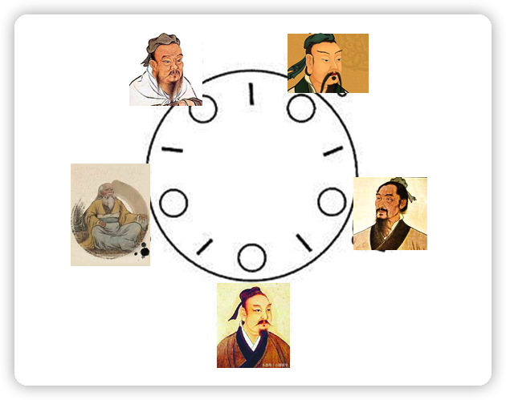
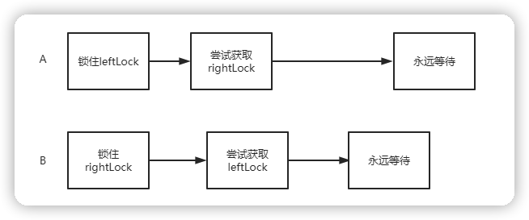
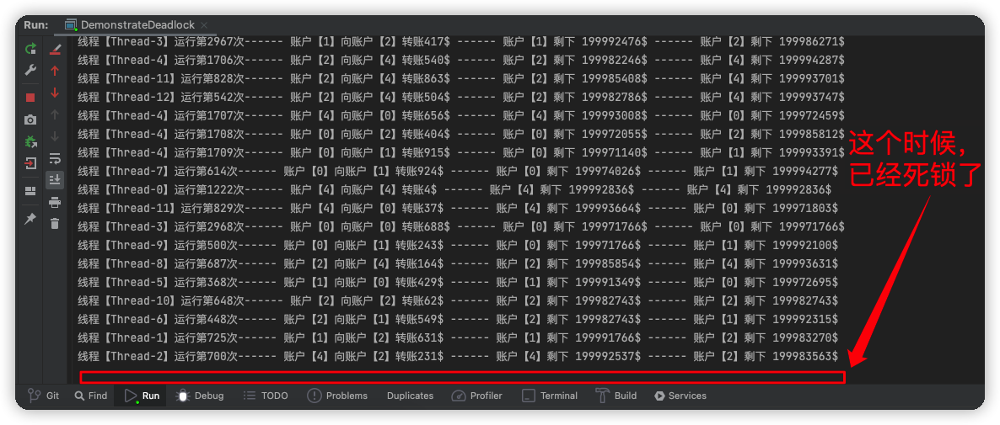
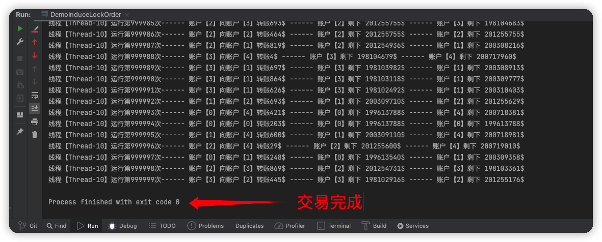
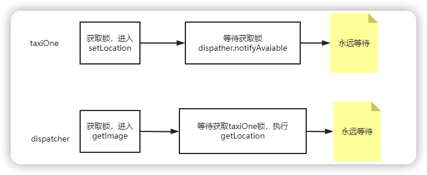

## 1. 死锁

> 哲学家进餐问题



* 这里有 5 个哲学家，以及 5 根筷子。
* 如果每个人都拿起左边的筷子，等待右侧筷子可用，同时不放弃手中的筷子，将导致死锁产生。

**当一个线程永远占有有一个锁，而其它线程尝试去占有这个锁，那么它们将永远被阻塞。**


## 2. 锁顺序死锁

> 简单的顺序死锁

```java
public class LeftRightDeadlock {
    private final Object left = new Object();
    private final Object right = new Object();

    public void leftRight() {
        synchronized (left) {
            synchronized (right) {
                doSomething();
            }
        }
    }

    public void rightLeft() {
        synchronized (right) {
            synchronized (left) {
                doSomethingElse();
            }
        }
    }

    void doSomething() {
    }

    void doSomethingElse() {
    }
}
```

* 对于 A、B 两个线程，分别锁住 left、right。
* 这个时候 A 线程想获取 right，B 线程想获取 left 锁
* A 线程获取不到 right，因为已经被 B 线程锁住
* 同样 B 线程也获取不到 left，因为 left 已经被 A 线程锁住



**如果所有的线程能够以固定的秩序获取锁，程序就不会出现锁顺序锁死了。**


## 3. 动态的锁顺序死锁

有时候我们并不能一目了然地看清是否己经对锁有足够的控制，来避免死锁的发生。

> 动态加锁顺序产生的死锁

```java
import java.util.concurrent.atomic.AtomicInteger;

public class DynamicOrderDeadlock {
    // Warning: 容易产生死锁
    public static void transferMoney(Account fromAccount,
                                     Account toAccount,
                                     DollarAmount amount)
            throws InsufficientFundsException {
        // 获得【借出钱】锁
        synchronized (fromAccount) {
            // 获得【去借钱】锁
            synchronized (toAccount) {
                // 如果【借出钱】的人账户 amount 没这么多钱，那么就抛出【资金不足】Exception
                if (fromAccount.getBalance().compareTo(amount) < 0)
                    throw new InsufficientFundsException();
                else {
                    // 资金充足，交易完成
                    fromAccount.debit(amount);
                    toAccount.credit(amount);
                }
            }
        }
    }

    static class DollarAmount implements Comparable<DollarAmount> {

        private int amount = 0;

        public DollarAmount(int amount) {
            this.amount = amount;
        }

        /** 增加 */
        public DollarAmount add(DollarAmount d) {
            this.amount = this.amount + d.amount;
            return this;
        }

        /** 减少 */
        public DollarAmount subtract(DollarAmount d) {
            this.amount = this.amount - d.amount;
            return this;
        }

        /** -1, 0, 1  ---- 小于，等于，大于 */
        public int compareTo(DollarAmount dollarAmount) {
            return Integer.compare(this.amount, dollarAmount.amount);
        }

        public int getAmount() {
            return amount;
        }
    }

    static class Account {
        private DollarAmount balance;
        private final int acctNo;
        private static final AtomicInteger sequence = new AtomicInteger();

        public Account() {
            acctNo = sequence.incrementAndGet();
        }

        /** 将钱借出 */
        void debit(DollarAmount d) {
            balance = balance.subtract(d);
        }

        /** 去借钱 */
        void credit(DollarAmount d) {
            balance = balance.add(d);
        }

        DollarAmount getBalance() {
            return balance;
        }

        public void setBalance(DollarAmount balance) {
            this.balance = balance;
        }

        int getAcctNo() {
            return acctNo;
        }
    }

    static class InsufficientFundsException extends Exception {
    }
}
```

如果两个线程同时调用 `transferMoney()`，一个从 X 向 Y 转账，另一个从 Y 向 X 转账，那么就会发生死锁：

```java
// thread_a
transferMoney(myAccount, yourAccount, 10);
// thread_b
transferMoney(yourAccount, myAccount, 20);
```

在偶发的时序中，thread_a 会获得 myAccount 的锁,并等待 yourAccount 的锁，然而 B 此时持有 yourAccount 的锁,正在等待 myAccount 的锁。


> 如何避免着清情况的死锁问题

解决办法：通过制定锁的顾序来避免死锁。

在制定锁顺序时，可以使用 `System.identityHashCode()` 方法，该方法将返回由 `Object.hashCode()` 返回的值。

示例：

```java
import java.util.concurrent.atomic.AtomicInteger;

public class InduceLockOrder {
    private static final Object tieLock = new Object();

    public static void transferMoney(final Account fromAcct,
                                     final Account toAcct,
                                     final DollarAmount amount)
            throws InsufficientFundsException {
        class Helper {
            public void transfer() throws InsufficientFundsException {
                // 如果【借出钱】的人账户 amount 没这么多钱，那么就抛出【资金不足】Exception
                if (fromAcct.getBalance().compareTo(amount) < 0)
                    throw new InsufficientFundsException();
                else {
                    // 资金充足，交易完成
                    fromAcct.debit(amount);
                    toAcct.credit(amount);
                }
            }
        }
        // 【借出钱者】、【借入钱者】分别对应的 Object.hashCode()
        int fromHash = System.identityHashCode(fromAcct);
        int toHash = System.identityHashCode(toAcct);

        // 制定获得锁顺序
        if (fromHash < toHash) {
            synchronized (fromAcct) {
                synchronized (toAcct) {
                    new Helper().transfer();
                }
            }
        } else if (fromHash > toHash) {
            synchronized (toAcct) {
                synchronized (fromAcct) {
                    new Helper().transfer();
                }
            }
        } else {
            synchronized (tieLock) {
                synchronized (fromAcct) {
                    synchronized (toAcct) {
                        new Helper().transfer();
                    }
                }
            }
        }
    }

    static class DollarAmount implements Comparable<DollarAmount> {

        private int amount = 0;

        public DollarAmount(int amount) {
            this.amount = amount;
        }

        /** 增加 */
        public DollarAmount add(DollarAmount d) {
            this.amount = this.amount + d.amount;
            return this;
        }

        /** 减少 */
        public DollarAmount subtract(DollarAmount d) {
            this.amount = this.amount - d.amount;
            return this;
        }

        /** -1, 0, 1  ---- 小于，等于，大于 */
        public int compareTo(DollarAmount dollarAmount) {
            return Integer.compare(this.amount, dollarAmount.amount);
        }

        public int getAmount() {
            return amount;
        }
    }

    static class Account {
        private DollarAmount balance;
        private final int acctNo;
        private static final AtomicInteger sequence = new AtomicInteger();

        public Account() {
            acctNo = sequence.incrementAndGet();
        }

        /** 将钱借出 */
        void debit(DollarAmount d) {
            balance = balance.subtract(d);
        }

        /** 去借钱 */
        void credit(DollarAmount d) {
            balance = balance.add(d);
        }

        DollarAmount getBalance() {
            return balance;
        }

        public void setBalance(DollarAmount balance) {
            this.balance = balance;
        }

        int getAcctNo() {
            return acctNo;
        }
    }

    static class InsufficientFundsException extends Exception {
    }
}
```


> 开始一个循环，它在典型条件下制定死锁

使用 DynamicOrderDeadlock，容易产生死锁：

```java
import java.util.Random;

public class DemonstrateDeadlock {

    private static final int NUM_THREADS = 20;
    private static final int NUM_ACCOUNTS = 5;
    private static final int NUM_ITERATIONS = 1000000;

    public static void main(String[] args) {
        final Random rnd = new Random();
        // 五个账户，每个账户先给它两个小目标 $
        final DynamicOrderDeadlock.Account[] accounts = new DynamicOrderDeadlock.Account[NUM_ACCOUNTS];
        for (int i = 0; i < accounts.length; i++) {
            DynamicOrderDeadlock.Account account = new DynamicOrderDeadlock.Account();
            account.setBalance(new DynamicOrderDeadlock.DollarAmount(200000000));
            accounts[i] = account;
        }

        class TransferThread extends Thread {
            public void run() {
                // 这五个账户之间发生了多笔不可描述的金钱交易
                for (int i = 0; i < NUM_ITERATIONS; i++) {
                    // 随机抽取两位幸运儿，发生金钱关系，金额不大于1000
                    int fromAcct = rnd.nextInt(NUM_ACCOUNTS);
                    int toAcct = rnd.nextInt(NUM_ACCOUNTS);
                    DynamicOrderDeadlock.DollarAmount amount =
                            new DynamicOrderDeadlock.DollarAmount(rnd.nextInt(1000));
                    try {
                        DynamicOrderDeadlock.transferMoney(accounts[fromAcct], accounts[toAcct], amount);
                        System.out.println("线程【" + Thread.currentThread().getName() + "】运行第" + i + "次------ " +
                            "账户【" + fromAcct + "】向账户【" + toAcct + "】转账" + amount.getAmount() + "$ ------ " +
                            "账户【" + fromAcct + "】剩下 " + accounts[fromAcct].getBalance().getAmount() + "$ ------ " +
                            "账户【" + toAcct + "】剩下 " + accounts[toAcct].getBalance().getAmount() + "$");
                    } catch (DynamicOrderDeadlock.InsufficientFundsException ignored) {
                    }
                }
            }
        }

        // 多线程交易！！！
        for (int i = 0; i < NUM_THREADS; i++) {
            TransferThread transferThread = new TransferThread();
            transferThread.start();
        }
    }
}
```

Output:



这里它们正常，20个线程，分别都应该发生 1000000 次交易的，不过在前面已经发生了死锁了。非法交易被警察抓了。


> 开始一个循环，它在制定锁顺序后的条件下，交易成功

使用 InduceLockOrder，笔笔交易完成：

```java
import java.util.Random;

public class DemoInduceLockOrder {
    private static final int NUM_THREADS = 20;
    private static final int NUM_ACCOUNTS = 5;
    private static final int NUM_ITERATIONS = 1000000;

    public static void main(String[] args) {
        final Random rnd = new Random();
        // 五个账户，每个账户先给它两个小目标 $
        final InduceLockOrder.Account[] accounts = new InduceLockOrder.Account[NUM_ACCOUNTS];
        for (int i = 0; i < accounts.length; i++) {
            InduceLockOrder.Account account = new InduceLockOrder.Account();
            account.setBalance(new InduceLockOrder.DollarAmount(200000000));
            accounts[i] = account;
        }

        class TransferThread extends Thread {
            public void run() {
                // 这五个账户之间发生了多笔不可描述的金钱交易
                for (int i = 0; i < NUM_ITERATIONS; i++) {
                    // 随机抽取两位幸运儿，发生金钱关系，金额不大于1000
                    int fromAcct = rnd.nextInt(NUM_ACCOUNTS);
                    int toAcct = rnd.nextInt(NUM_ACCOUNTS);
                    InduceLockOrder.DollarAmount amount =
                            new InduceLockOrder.DollarAmount(rnd.nextInt(1000));
                    try {
                        InduceLockOrder.transferMoney(accounts[fromAcct], accounts[toAcct], amount);
                        System.out.println("线程【" + Thread.currentThread().getName() + "】运行第" + i + "次------ " +
                                "账户【" + fromAcct + "】向账户【" + toAcct + "】转账" + amount.getAmount() + "$ ------ " +
                                "账户【" + fromAcct + "】剩下 " + accounts[fromAcct].getBalance().getAmount() + "$ ------ " +
                                "账户【" + toAcct + "】剩下 " + accounts[toAcct].getBalance().getAmount() + "$");
                    } catch (InduceLockOrder.InsufficientFundsException ignored) {
                    }
                }
            }
        }

        // 多线程交易！！！
        for (int i = 0; i < NUM_THREADS; i++) {
            TransferThread transferThread = new TransferThread();
            transferThread.start();
        }
    }
}
```

Output:



在有序的规则下，没有被抓，顺利完成了多次交易。


## 4. 协作对象间的死锁

**如果在持有锁的情况下需要调用某个外部方法，就需要警惕死锁。**

如果在持有锁时调用某个外部方法，那么将出现活跃性问题。在这个外部方法中可能或获取其他锁（这可能产生死锁），或者阻塞时间过长，导致其他线程无法及时获得当前被持有的锁。

> 协作对象间的锁顺序死锁

```java
import net.jcip.annotations.GuardedBy;

import java.awt.Point;
import java.util.HashSet;
import java.util.Set;

public class CooperatingDeadlock {
    // Warning: 可能产生死锁
    class Taxi {
        @GuardedBy("this")
        private Point location, destination;
        private final Dispatcher dispatcher;

        public Taxi(Dispatcher dispatcher) {
            this.dispatcher = dispatcher;
        }

        public synchronized Point getLocation() {
            return location;
        }

        public synchronized void setLocation(Point location) {
            this.location = location;
            if (location.equals(destination)) {
                dispatcher.notifyAvailable(this);
            }
        }

        public synchronized Point getDestination() {
            return destination;
        }

        public synchronized void setDestination(Point destination) {
            this.destination = destination;
        }
    }

    class Dispatcher {
        @GuardedBy("this")
        private final Set<Taxi> taxis;
        @GuardedBy("this")
        private final Set<Taxi> availableTaxis;

        public Dispatcher() {
            taxis = new HashSet<Taxi>();
            availableTaxis = new HashSet<Taxi>();
        }

        public synchronized void notifyAvailable(Taxi taxi) {
            availableTaxis.add(taxi);
        }

        public synchronized Image getImage() {
            Image image = new Image();
            for (Taxi t : taxis) {
                image.drawMarker(t.getLocation());
            }
            return image;
        }
    }

    class Image {
        public void drawMarker(Point p) {
        }
    }
}
```

虽然没有显示调用锁，但是`Taxi.setLocation`方法和`Dispatcher.getImage`由于获取锁仍然可能发生死锁情况：




> 使用开放调用来避免协作对象之间的死锁

```java
import net.jcip.annotations.GuardedBy;
import net.jcip.annotations.ThreadSafe;

import java.awt.Point;
import java.util.HashSet;
import java.util.Set;

public class CooperatingNoDeadlock {
    @ThreadSafe
    class Taxi {
        @GuardedBy("this")
        private Point location, destination;
        private final Dispatcher dispatcher;

        public Taxi(Dispatcher dispatcher) {
            this.dispatcher = dispatcher;
        }

        public synchronized Point getLocation() {
            return location;
        }

        public synchronized void setLocation(Point location) {
            boolean reachedDestination;
            synchronized (this) {
                this.location = location;
                reachedDestination = location.equals(destination);
            }
            if (reachedDestination) {
                dispatcher.notifyAvailable(this);
            }
        }

        public synchronized Point getDestination() {
            return destination;
        }

        public synchronized void setDestination(Point destination) {
            this.destination = destination;
        }
    }

    @ThreadSafe
    class Dispatcher {
        @GuardedBy("this")
        private final Set<Taxi> taxis;
        @GuardedBy("this")
        private final Set<Taxi> availableTaxis;

        public Dispatcher() {
            taxis = new HashSet<Taxi>();
            availableTaxis = new HashSet<Taxi>();
        }

        public synchronized void notifyAvailable(Taxi taxi) {
            availableTaxis.add(taxi);
        }

        public Image getImage() {
            Set<Taxi> copy;
            synchronized (this) {
                copy = new HashSet<Taxi>(taxis);
            }
            Image image = new Image();
            for (Taxi t : copy) {
                image.drawMarker(t.getLocation());
            }
            return image;
        }
    }

    class Image {
        public void drawMarker(Point p) {
        }
    }

}
```


## 5. 开放调用

方法调用相当于一种抽象屏障，你无需了解在调用方法中所执行的操作，也正是由于不知道在被调用方法中执行的操作，因此在持有锁的时候对调用某个外部方法将难以进行分析，从而可能出现死锁。

> **如果在调用某个方法时不需要持有锁，那么这种调用被称为开放调度（Open Call）。**

* 依赖于开放调用的类会具有更好的行为，并且比那些需要获得锁才能调用的方法相比，更容易与其他的类合作。
* 使用开放调用来避免死锁类似于使用封裝来提供线程安全：尽管我们能够保证在没有封装的情况下构建线程安全的程序，但是对一个有效封装的类进行线程安全分析，要比分析没有封装的类容易得多。
* 类似地，分析一个完全依赖于开放调用的程序的程序活跃度，比分析那些非开放调用的程序更简单。尽量让你自己使用开放调用，这要比获得多重锁后识别代码路径更简单，因此可以确保用一致的顺序获得锁。

**在程序中尽量使用开放调用。依赖于开放调用的程序，相比于那些在持有锁的时侯还调用外部方法的程序，更容易进行死锁自由度(deadlock-freedom）的分析。**


## 6. 资源死锁

* 当线程间相互等待对方持有的锁，并且谁都不会释放自己的锁时就会发生死锁，当线程持有和等待的目标变为资源时，会发生与之相类似的死锁。
* 假设你有两个放入池中的资源，比如分别是到两个数据库连接的连接池。当池为空的时候发生阻塞。
    * 如果一个任务需要连接到两个数据库，并且两个资源并不是按照相同顺序进行调用的。
    * 线程A可能持有数据库 D1 的连接，并等待连接到数据库 D2。
    * 而线程B持有数据库 D2 的连接并等待到 D1 的连接。
    * 资源死锁 ... 完蛋
* 另一种基于资源的死锁形式就是**线程饥饿死锁（Thread-Starvation Deadlock）。**
    * 一个 TaskA 将工作提交到单线程化的 Executor，并等待后面向该 Executor 提交的 TaskB 的计算结果。
    * TaskA 等待 TaskB 的计算结果，久久不能结束。
    * 而单线程化的 Executor 需要执行完一个任务(TaskA)才能执行第二个任务(TaskB)。
    * 即 TaskA 等 TaskB，TaskB 等 TaskA。就互等。