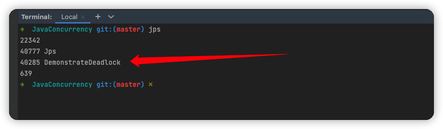
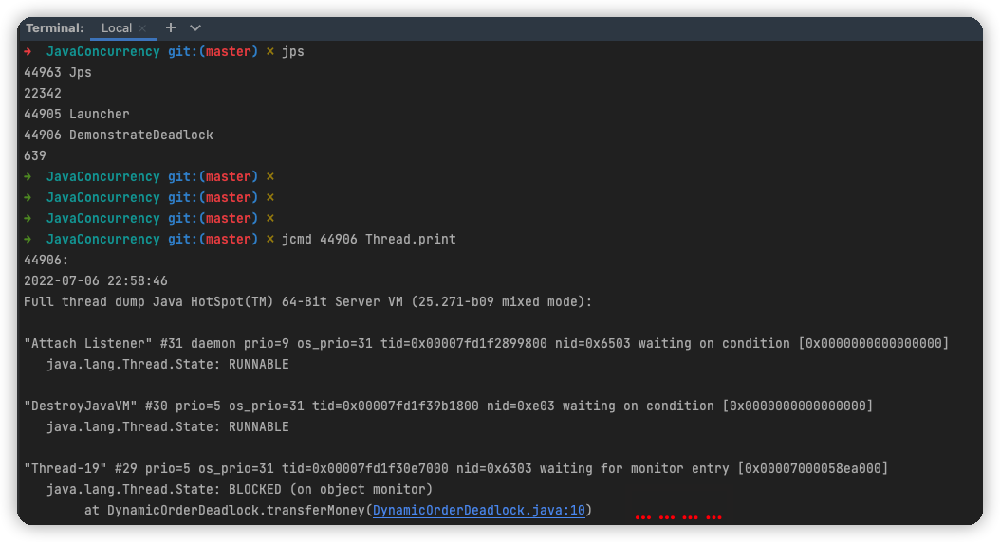
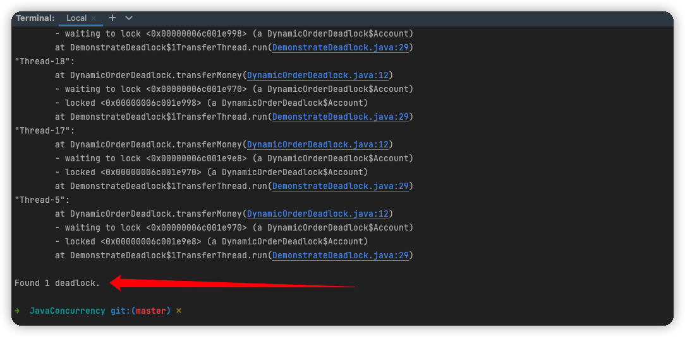

## 1. 避免和诊断死锁

* 如果一个程序一次至多获得一个锁，那么就不会产生锁顺序死锁。
* 如果必须获得多个锁那么我们应该要制定锁顺序。尽量减少潜在锁之间的交互数量。


## 2. 尝试定时的锁

* 在使用内部锁 synchronized 时，如果一个程序需要获得多个锁，容易造成死锁。
* 可以使用显式锁，来检测死锁和从锁中恢复。
* java.util.concurrent.locks.Lock 类，与使用 synchronized 代码块相比，Lock 实现提供了更广泛的锁定操作。它们允许更灵活的结构。
* 调用 `Lock.tryLock()` 方法。如果锁可用，则获取锁并立即返回值为true。如果锁不可用，则此方法将立即返回值false。
* 在内部锁(synchronized)机制中，只有没有获得锁，就会永远保持等待，而 `Lock.tryLock(long time, TimeUnit unit)` 可以自定义超时时间。


## 3. 通过线程转储分析死锁

* JVM 通过 `线程转储`(thread dump) 帮助开发者识别死锁的发生。
* 线程转储
    * 包括每个运行中线程的栈追踪信息
    * 与之相似并随之发生的异常
    * 以及锁的信息（如：被哪个线程获得、锁的栈结构、阻塞线程等待的是哪个锁）
* 在生成线程转储之前，JVM 在表示 “正在等待(is-waiting-for)” 关系的（有向）图中搜索循环来寻找死锁。
* 如果发现了死锁，它就会包括死锁的识别信息，其中参与了哪些锁和线程，以及程序中造成不良后果的锁请求发生在哪里。


> 转储分析死锁

【第10章 - 1.死锁】部分的示例：开始一个循环，它在典型条件下制定死锁

```java
import java.util.Random;

public class DemonstrateDeadlock {

    private static final int NUM_THREADS = 20;
    private static final int NUM_ACCOUNTS = 5;
    private static final int NUM_ITERATIONS = 1000000;

    public static void main(String[] args) {
        final Random rnd = new Random();
        // 五个账户，每个账户先给它两个小目标 $
        final DynamicOrderDeadlock.Account[] accounts = new DynamicOrderDeadlock.Account[NUM_ACCOUNTS];
        for (int i = 0; i < accounts.length; i++) {
            DynamicOrderDeadlock.Account account = new DynamicOrderDeadlock.Account();
            account.setBalance(new DynamicOrderDeadlock.DollarAmount(200000000));
            accounts[i] = account;
        }

        class TransferThread extends Thread {
            public void run() {
                // 这五个账户之间发生了多笔不可描述的金钱交易
                for (int i = 0; i < NUM_ITERATIONS; i++) {
                    // 随机抽取两位幸运儿，发生金钱关系，金额不大于1000
                    int fromAcct = rnd.nextInt(NUM_ACCOUNTS);
                    int toAcct = rnd.nextInt(NUM_ACCOUNTS);
                    DynamicOrderDeadlock.DollarAmount amount =
                            new DynamicOrderDeadlock.DollarAmount(rnd.nextInt(1000));
                    try {
                        DynamicOrderDeadlock.transferMoney(accounts[fromAcct], accounts[toAcct], amount);
                        System.out.println("线程【" + Thread.currentThread().getName() + "】运行第" + i + "次------ " +
                            "账户【" + fromAcct + "】向账户【" + toAcct + "】转账" + amount.getAmount() + "$ ------ " +
                            "账户【" + fromAcct + "】剩下 " + accounts[fromAcct].getBalance().getAmount() + "$ ------ " +
                            "账户【" + toAcct + "】剩下 " + accounts[toAcct].getBalance().getAmount() + "$");
                    } catch (DynamicOrderDeadlock.InsufficientFundsException ignored) {
                    }
                }
            }
        }

        // 多线程交易！！！
        for (int i = 0; i < NUM_THREADS; i++) {
            TransferThread transferThread = new TransferThread();
            transferThread.start();
        }
    }
}
```

启动程序后，控制台通过 jps 获取进程 PID：



jcmd 工具向目标 JVM 发送一串命令：

```java
jcmd PID号 Thread.print
```






其中有一部分输出是这样的：

```
Found one Java-level deadlock:
=============================
"Thread-19":
  waiting to lock monitor 0x00007fd1f1a3bb48 (object 0x00000006c001e998, a DynamicOrderDeadlock$Account),
  which is held by "Thread-18"
"Thread-18":
  waiting to lock monitor 0x00007fd1f32b3de8 (object 0x00000006c001e970, a DynamicOrderDeadlock$Account),
  which is held by "Thread-17"
"Thread-17":
  waiting to lock monitor 0x00007fd1f1818cc8 (object 0x00000006c001e9e8, a DynamicOrderDeadlock$Account),
  which is held by "Thread-5"
"Thread-5":
  waiting to lock monitor 0x00007fd1f32b3de8 (object 0x00000006c001e970, a DynamicOrderDeadlock$Account),
  which is held by "Thread-17"

Java stack information for the threads listed above:
===================================================
```

Thread-19 等 Thread-18

Thread-18 等 Thread-17

Thread-17 等 Thread-5

Thread-5 等 Thread-17

互等，完犊子了。