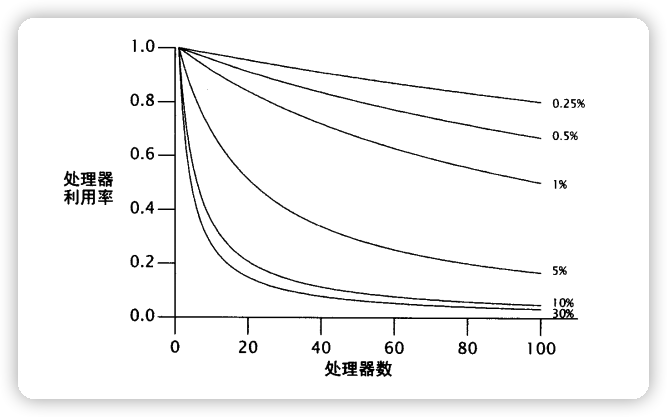

## 1. 性能可伸缩性

* 使用多线程可以使程序更充分的发挥出闲置的处理能力，从而更好地利用资源；
* 使用多线程，还能够使程序在现有任务正在运行的情况下立刻开始着手处理新的任务，从而提高系统的响应性。


## 2. 性能的思考

* 对于给定的活动而言，一些特定的资源通常非常缺乏，无论是CPU周期、内存、网络带宽、I/O带宽、数据库请求、磁盘空间、以及其他一些资源。
* 当活动的运行因某个特定资源受阻时，我们称之为受限于该资源：受限于CPU、受限于数据库。

> 可伸缩性指的是：当增加计算资源的时候（比如增加额外 CPU 数量、内存、存储器、TO 带宽)，吞吐量和生产量能够相应地得以改进。


### 2.1 对性能的权衡进行评估

* 几乎所有的工程上的决定都会遇到某些形式的折中。
* 如空间换时间、金钱换算力等等。
* 要避免不成熟的优化。首先要使我们的程序正确，然后再加快。
* 对性能调优时，一定要有明确的性能需求。对性能调优后，需要再次测量以验证是否达到了预期的性能提升目标。


### 2.2 Amdahl 定律

* 对于并发性的问题，有时候使用越多的资源，就能越快地解决。

* 不过对于一些串行化的任务来说，可能提供更多的资源，却不能够提高处理速度。

* 大多数的并发程序由一系列并行化和串行化的片段组成。

* Amdahl 定律描述了在一个系统中，基于可并行化和串行化的组件各自所占的比重，程序通过获得额外的计算资源，理论上能參加速多少。
    $$
    Speedup \leq 1 \div [F + \big(1 - F\big)\div N ]
    $$

* N 表示处理器数量，F表示串行化任务的比重。

* 当 N 无限增大趋近无穷大时，下面公式结果可以忽略不计。
    $$
    \big(1 - F\big)\div N
    $$
    

* 即当给定足够的处理器(N)时，`Speedup` 不等式可以看作如下：
    $$
    Speedup \leq 1 \div F
    $$
    

* 也就是说，一个程序中，如果 50% 的处理都是串行化进行的话。当处理器算力充足，最多只能提升 2 倍的性能。

* Amdahl 定律中不同串行化的百分比，带来的最大的效能

    


> 串行访问任务队列

```java
import java.util.concurrent.BlockingQueue;

public class WorkerThread extends Thread {
    private final BlockingQueue<Runnable> queue;

    public WorkerThread(BlockingQueue<Runnable> queue) {
        this.queue = queue;
    }

    public void run() {
        while (true) {
            try {
                Runnable task = queue.take();
                task.run();
            } catch (InterruptedException e) {
                break;
            }
        }
    }
}
```

* 这个例子忽略了另一个的相同的串行源：结果处理。
* 所有有用的计算都产生一些结果集或者边界效应。
* 因为 Runnable 没有提供明确的结果处理，这些任务必须具有一些边界效应，设定把它们的结果写入日志或者存入一个数据结构。
* 日志文件和结果容器通常由多个工作者线程共享，并且因此成为了同源的串行部分。
* 如果不是每个线程各自维护自己的结果的数据结构，而是在所有任务都执行完成后合并所有的结果，这最终的合并就成为了一个串行源。


## 3. 线程引入的开销

### 3.1 切换上下文

* 如果可运行的线程数大于 CPU 的数量，那么 OS 最终回强行换出正在执行的线程，从而使其他线程能过使用 CPU。
* 这会引起上下文切换，它会保存当前运行线程的执行上下文，并重建调入线程的执行上下文。
* 切换上下文需要一定的开销，而在线程调度过程中需要访问由操作系统和 JVM 共享的数据结构。
* 上下文切换的开销并不只是包含 JVM 和操作系统的开销。
* 当一个新的线程被切换进来时，它所需要的数据可能不在当前处理器的本地缓存中，因此上下文切换将导致一些缓存缺失，因而线程在首次调度运行时会更加缓慢。
* 即使由很多其他正在等待的线程，调度器也会为每个可运行的线程分配一个最小执行时间。调度器将分期偿付切换上下文的开销，获得更多不中断的执行时间，从而提高整体的吞吐量。


### 3.2 内存同步

* synchronized 和 volatile 提供的可见性保证要求使用一个特殊的、名为 `存储关卡(memory barrier)` 的指令，它可以刷新缓存，使缓存无效，刷新硬件的写缓冲，以及停止执行管道。

* `存储关卡` 可能同样会对性能产生影响，因为它们抑制了其他编译器的优化；在存储关卡中，大多数操作是不能被重排序的。

* 现代的 JVM 能够通过优化，来去掉一些不会发生资源竞争的锁，从而减少额外的同步。如:

    ```java
    synchronized (new Object()) {
        // .....
    }
    ```

    

* 更加成熟的 JVM 可以使用 `逸出分析(escape analysis)` 来识别本地对象的引用(即找出不会被发布到堆的本地对象引用)，并且因此成为线程本地的。如：

    ```java
    public String getStoogeNames() {
        List<String> stooges = new Vector<>();
        stooges.add("Moe");
        stooges.add("Larry");
        stooges.add("Curly");
        return stooges.toString();
    }
    ```

    在本地执行 `getStoogeNames()` 至少需要获取/释放 `Vector` 的锁 4 次，每个 `add()` 一次，`toString()` 一次。

    成熟的编译器能够分析出该程序内部状态一直没有逸出，因此这 4 次对锁的请求就可以被消除了。

    

* 即使编译器没有逸出分析，它还可以进行 `锁的粗化(lock coarsening)`，把邻近的同步代码块用相同的锁合并起来。

* 在 `getStoogeNames()` 中，JVM 如果进行锁的粗化，可能会把3个 `add()` 调用结合起来，并对 `toString()` 使用当读的锁请求和释放。并采用启发式方法来评估同步代码块中采用同步操作以及指令之间的相对开销。


### 3.3 阻塞

* 如上面所述，非竞争的同步可以由 JVM 完全掌控。
* 当锁为竞争性的时候，失败的线程会发生阻塞。
* JVM 能 `自旋等待(spin-waiting)` 不断尝试获取锁，直到成功
* JVM 还能在操作系统中 `挂起(suspending)` 被阻塞的线程。
* 自旋等待适合短期的等待，而挂起适合长时间等待。
* 挂起需要两次额外的上下文切换，以及OS和缓存的相关活动
    * 阻塞的线程在它被CPU分配的执行时间内，还没有到期前就被换出。
    * 稍后如果能够获得锁/资源，又会被换入。

阻塞归因于锁的竞争，线程持有锁：当它释放该锁的时候，它必须通知操作系统，重新开始因该锁而阻塞的其它线程。


## 4. 减少锁的竞争

* `串行化` 会损害可伸缩性，`上下文切换` 会损害性能。
* 减少锁的竞争能改进性能和可伸缩性。
* 并发程序中，对可伸缩性首要的威胁是独古的资源锁。
* 锁的竞争性因素：锁被请求的频率，以及每次持有该锁的时间。(如果两者乘积足够小，可以认为是非竞争性的)

> 如何减少锁的竞争：

1. 减少持有锁的时间
2. 减少请求锁的频率
3. 用协调机制取代独占锁，从而允许更强的并发性


### 4.1 缩小锁的范围

* 尽量缩短锁的持有时间。

    将一些与锁无关的代码移出同步代码块

    > 持有锁超过必要的时间

    ```java
    import net.jcip.annotations.GuardedBy;
    import net.jcip.annotations.ThreadSafe;
    
    import java.util.HashMap;
    import java.util.Map;
    import java.util.regex.Pattern;
    
    @ThreadSafe
    public class AttributeStore {
        @GuardedBy("this") 
        private final Map<String, String> attributes = new HashMap<>();
    
        public synchronized boolean userLocationMatches(String name, String regexp) {
            String key = "users." + name + ".location";
            String location = attributes.get(key);
            if (location == null) {
                return false;
            } else {
                return Pattern.matches(regexp, location);
            }
        }
    }
    ```

    > 减少锁持续的时间

    ```java
    import net.jcip.annotations.GuardedBy;
    import net.jcip.annotations.ThreadSafe;
    
    import java.util.HashMap;
    import java.util.Map;
    import java.util.regex.Pattern;
    
    @ThreadSafe
    public class BetterAttributeStore {
        @GuardedBy("this")
        private final Map<String, String> attributes = new HashMap<>();
    
        public boolean userLocationMatches(String name, String regexp) {
            String key = "users." + name + ".location";
            String location;
            synchronized (this) {
                location = attributes.get(key);
            }
            if (location == null) {
                return false;
            } else {
                return Pattern.matches(regexp, location);
            }
        }
    }
    ```

    这消除了可伸缩性的一个阻碍，因为串行化的代码少了。

    在上面代码中，`attributes` 成员变量可以使用 `代理线程安全` 的技术，通过使用 `Hashtable`、`synchronizedMap`、`ConcurrentHashMap` 来取代 `HashMap`。即用线程安全的容器来代理所有线程安全的职责。

* 同步代码块不能过小。一些需要采用原子方式执行的操作必须包含在一个同步块中。


### 4.2 减小锁的粒度

* 可以通过`分拆锁(lock spliting)`和`分离锁(lock striping)`来减小锁的粒度。
* 采用相互独立的锁，守卫多个独立的状态变量，在改变之前，它们都是由一个锁守护的。
* `分拆锁(lock spliting)`和`分离锁(lock striping)`减小了锁发生时的粒度，潜在实现了更好的可伸缩性（使用的锁越多越会增加死锁的风险）


如果整个程序只有一个锁，而不是每个对象分配一个独立的锁。那么，执行所有的 synchronized 代码块时，不考虑锁的情况，就会成为串行化执行。因为很多线程都在竞争相同的锁。

简单理解就是整个学校九成的人都是独立(单身)的异性，你脱单的概率是不是就高了很多。同理整个学校九成的都是独立(单身)的同性，那是不是就很多人竞争了(口味独特的除外)。

> 应当分拆锁的候选程序

```java
import net.jcip.annotations.GuardedBy;
import net.jcip.annotations.ThreadSafe;

import java.util.HashSet;
import java.util.Set;

@ThreadSafe
public class ServerStatusBeforeSplit {
    @GuardedBy("this")
    public final Set<String> users;
    @GuardedBy("this")
    public final Set<String> queries;

    public ServerStatusBeforeSplit() {
        users = new HashSet<String>();
        queries = new HashSet<String>();
    }

    public synchronized void addUser(String u) {
        users.add(u);
    }

    public synchronized void addQuery(String q) {
        queries.add(q);
    }

    public synchronized void removeUser(String u) {
        users.remove(u);
    }

    public synchronized void removeQuery(String q) {
        queries.remove(q);
    }
}
```

> 使用分拆锁重构 ServerStatus

```java
import net.jcip.annotations.GuardedBy;
import net.jcip.annotations.ThreadSafe;

import java.util.HashSet;
import java.util.Set;

@ThreadSafe
public class ServerStatusAfterSplit {
    @GuardedBy("users") public final Set<String> users;
    @GuardedBy("queries") public final Set<String> queries;

    public ServerStatusAfterSplit() {
        users = new HashSet<String>();
        queries = new HashSet<String>();
    }

    public void addUser(String u) {
        synchronized (users) {
            users.add(u);
        }
    }

    public void addQuery(String q) {
        synchronized (queries) {
            queries.add(q);
        }
    }

    public void removeUser(String u) {
        synchronized (users) {
            users.remove(u);
        }
    }

    public void removeQuery(String q) {
        synchronized (users) {
            queries.remove(q);
        }
    }
}
```


### 4.3 分离锁

* 把一个竟争潡烈的锁分拆成两个，很可能形成两个竟争激烈的锁。尽管这可以通过两个线程并发执行，取代一个线程，从而对可伸缩性有一些小的改进，但这仍然不能大幅地提高多个处理器在同一系统中并发性的前景。
* `分拆锁`有时候可以被`扩展`，分成可大可小加锁块的集合，并且它们**归属于相互独立的对象**，这样的情况就是`分离锁`。
* ConcurrentHashMap 的实现是用来一个包含 16 个锁的 Array，每一个锁都守护 Hash Bucket 的 `1/16` 。Bucket N 由第 N mod 16个锁来守护。这也使得 ConcurrentHashMap 能够支持 16 个并发的 Writer。
* 分离锁的一个劣势在于：与采用单个锁来实现独占访问相比，要获得多个锁来实现独占访问将更加困难并且开销更高。
* 通常，在执行一个操作时最多只需获得一个锁，但在某些情况下需要加锁整个容器。例如 ConcurrentHashMap 的值需要被扩展、重排，放入一个更大的 Bucket 是，这时就需要获得所有分离的锁。

> 基于 Hash值的 map 中使用分离锁

```java
import net.jcip.annotations.ThreadSafe;

@ThreadSafe
public class StripedMap {
    // 同比策略: buckets[n] 由 locks[n%N_LOCKS] 保护
    private static final int N_LOCKS = 16;
    private final Node[] buckets;
    private final Object[] locks;

    private static class Node {
        Node next;
        Object key;
        Object value;
    }

    /**
     * 分离锁的 map
     * @param numBuckets map 容量
     */
    public StripedMap(int numBuckets) {
        buckets = new Node[numBuckets];
        locks = new Object[N_LOCKS];
        for (int i = 0; i < N_LOCKS; i++) {
            locks[i] = new Object();
        }
    }

    /** hash 值。通过 key 的hash值除以桶个数求余，取绝对值得出 */
    private final int hash(Object key) {
        return Math.abs(key.hashCode() % buckets.length);
    }

    public Object get(Object key) {
        int hash = hash(key);
        // locks[hash % N_LOCKS] --> 守护 buckets[hash]
        synchronized (locks[hash % N_LOCKS]) {
            for (Node m = buckets[hash]; m != null; m = m.next) {
                if (m.key.equals(key)) {
                    return m.value;
                }
            }
        }
        return null;
    }

    public void clear() {
        for (int i = 0; i < buckets.length; i++) {
            // locks[i % N_LOCKS] --> 守护 buckets[i]
            synchronized (locks[i % N_LOCKS]) {
                buckets[i] = null;
            }
        }
    }
}
```


### 4.4 避免热点域

* 分拆锁和分离锁能够改进可伸缩性，因为它们能够使不同的线程操作不同的数据(或者相同数据结构的不同部分)，而不会发生相互干扰。
* 如果一个锁守护两个独立变量 X 和 Y，线程 A 想要访问 X，而线程 B 想要访问 Y，这两个线程没有竟争任何数据，然而它们竞争相同的锁。
* 当每一个操作都请求变了的时候，锁的粒度很难被降低。性能和可伸缩性相互牵制。(优化：如缓存常用的计算结果、引入热点域，从而限制可伸缩性)
* 对于 HashMap，就是引入热点域 `size`，缓存size操作的结果，每次增减元素都及时更新。


### 4.5 独占锁的替代方法

* `ReadWriteLock` 实行了一个 **多读者-单写者**(multiple-reader, single-write)加锁规则：只要没有更改，那么多个读者可以并发访问共享资源，但是写者必须独占获得锁。
* 对于多数操作都为读操作的数据结构，ReadWriteLock 与独占锁相比，可以提供更好的并发性。
* 原子变量类提供了针对整数或对象饮用的非常精妙的原子操作(因此更具可伸缩性)，并且使用现代处理器提供的底层并发原语(如：比较并交换`compare-and-swap`)
* 如果类中只有少量的热点域，并且该类不参加与其它变量的不变约束，那么使用原子变量替代它可能会提高可伸缩性。


### 4.6 不使用 `对象池`

* 在 JVM 的早期版本中，对象分配和垃圾回收等操作的执行速度非常慢，但在后续的版本中，这些操作的性能得到了极大提高。
* 为了解决 “缓慢的” 对象生命周期问题，许多开发人员都选择使用对象池，在对象池中，对象能被循环使用，而不是由垃圾收集器回收并在需要重新分配。
* 在并发程序中，对象池表现得比较糟糕。当线程分配新的对象时，需要线程内部非常细微的协调，因为分配运算通常使用本地的分配代码块来小区对象堆中的大部分同步。
* 对多个线程从对象池中请求对象，协调访问对象池的数据结构要使用同步技术，因此可能会产生线程阻塞。
* 锁竞争产生的阻塞，其代价比直接创建对象多几百倍。不推荐使用对象池。


## 5. 减少上下文切换的开销

很多任务引入的操作都会发生阻塞，在运行和阻塞这两个状态之间转换，需要使用上下文切换。

> 日志消息

* 服务器应用程序发生阻塞的一个缘由是在处理请求期间产生日志消息。
* 大多数日志框架都是围绕 `println` 进行 “瘦” 包装的。
* LogWriter 日志记录的工作由一个专职的后台线程完成，而不是由请求线程完成。
* 日志操作的服务时间包括与 InputStream/OutputStream 相关的类花费的时间。
* 如果【线程a】 `I/O` 操作发生阻塞，它很可能包括线程被阻塞的时间。操作系统会把这个阻塞线程从调度队列中移出，直到 I/O 结束，并且很可能比这个花费的时间更长。当 I/O 结束的时候，其他线程可能被唤醒，并被允许完成它们的调度时间限额，并且在调度队列中有些线程可能已经排在【线程a】前面了。这种情况会增加【线程a】的服务时间。
* 如果多个线程同时记录日志，它们可能还会竞争输出流的锁。这与阻塞I/O一样(线程阻塞，等待获得锁，然后被换出 ---- 上下文切换增多)


> 把 I/O 操作从主线程中分离出来

* 把 I/O 操作从请求处理线程中分离出来很可能缩短处理请求的平均服务时间。
* 调用 I/O 操作的线程，不再因为等待输出流的锁，或者等待 I/O 完成而发生阻塞；它们只需使消息加入队列，然后返回到它们自己的任务中即可。
* 这样操作，使得请求线程在处理时，减少了 I/O 操作带来的阻塞，也就是说减少了上下文被换出。
* 把所有的日志 I/O 移入一个线程，消除了输出流的竞争，也减少了竞争源。


