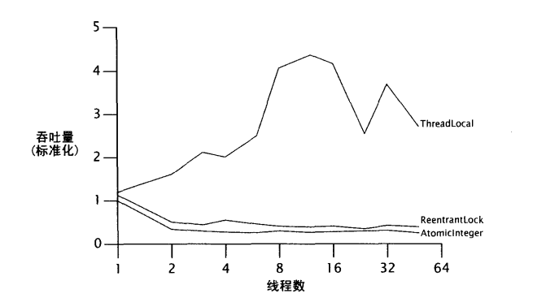

## 1. 锁的劣势

> volatile 变量

* `volatile` 变量与锁相比是更轻量的同步机制，因为它们不会引起上下文的切换和线程调度。
* 然而，volatile 变量与锁相比有一些局限性：尽管它们提供了相似的可见性保证，但是它们不能用于构建原子化的复合操作。
* 当一个变量依赖其他变量时，或者当变量的新值依赖于旧值时，是不能用 volatile 变量的。这些都限制了 volatile 变量的使用，因此它们不能用于实现可靠的通用工具，比如计数器，或互斥体(mutex）

例如 `i++` 看起来是原子操作(变量的新值依赖于旧值)，事实上有三个独立操作：获取当前值、为该值加一、协会更新值。为了不丢失更新，整个的 `读-写-改` 操作必须是原子的。


> 加锁可能存在的缺点

Counter示例：

```java
import net.jcip.annotations.GuardedBy;
import net.jcip.annotations.ThreadSafe;

/**
 * Counter 是线程安全的，不过在竞争下，性能回由于上下文切换的开销和调度延迟而收到损失。
 * 倘若临时占有锁的线程进入休眠，将会导致其它线程的阻塞。
 */
@ThreadSafe
public final class Counter {
    @GuardedBy("this")
    private long value = 0;

    public synchronized long getValue() {
        return value;
    }

    public synchronized long increment() {
        if (value == Long.MAX_VALUE) {
            throw new IllegalStateException("counter overflow");
        }
        return ++value;
    }
}
```


* 加锁还有其它的缺点。当一个线程正在等待锁时，它不能做任何其它事情。
* 如果一个线程在持有锁的情况下发生了延迟(如：页错误、调度延迟)，那么其它所有需要改锁的线程都不能前进了。
* 如果阻塞的线程是优先级很高的线程，持有锁的线程优先级较低，那么就导致了**优先级倒置(priority inversion)**


## 2. 硬件对并发的支持

- 乐观锁：乐观锁在操作数据时非常乐观，认为多个线程不会同时修改数据。因此乐观锁不会上锁，只是在执行更新的时候判断一下在此期间别人是否修改了数据：如果别人修改了数据则放弃操作，否则执行操作。
- 悲观锁：悲观锁在操作数据时比较悲观，认为别人会同时修改数据。因此操作数据时直接把数据锁住，直到操作完成后才会释放锁；上锁期间其他人不能修改数据

* 独占锁(如ReentrantLock)模式下，每次只能有一个线程能持有锁。它是一项 **悲观** 保守的加锁策略。
* 对于细粒度的操作，可以使用乐观锁，在不发生干扰的情况下完成更新操作。


### 2.1 比较并交换(compare-and-swap)

> 乐观策略

* 当多个线程试图使用比较并交换(CAS)，同时更新相同的变量时，其中一个线程会胜出，并且更新变量的值，而其它的线程都会失败。
* 失败的线程允许尝试再次比较并交换操作。一个线程在竞争 CAS 时失败，不会被阻塞，它可以决定是否重试，这样的灵活性大大减少了锁相关的活跃度风险。


> 模拟CAS操作

```java
import net.jcip.annotations.GuardedBy;
import net.jcip.annotations.ThreadSafe;

@ThreadSafe
public class SimulatedCAS {
    @GuardedBy("this")
    private int value;

    public synchronized int get() {
        return value;
    }

    /**
     * 比较并交换。
     * 如果旧值等于期望值，那么设置新值(newValue)。
     * @param expectedValue 期望值
     * @param newValue 新值
     * @return 旧值
     */
    public synchronized int compareAndSwap(int expectedValue,
                                           int newValue) {
        int oldValue = value;						// 获取
        if (oldValue == expectedValue) {			// 比较
            value = newValue;						// 交换
        }
        return oldValue;
    }

    /**
     * 比较并交换。
     * 如果旧值等于期望值，那么设置新值(newValue)。
     * 设置新值成功，返回 true，否则返回 false
     * @param expectedValue 期望值
     * @param newValue 新值
     * @return 新值设置成功，旧值 == 期望值，返回 true
     */
    public synchronized boolean compareAndSet(int expectedValue,
                                              int newValue) {
        return (expectedValue
                == compareAndSwap(expectedValue, newValue));
    }
}
```


### 2.2 非阻塞计数器

> 竞争锁和非竞争锁

* 当一个线程试图进入另一个线程正在执行的同步块或方法时会触发**锁竞争**。该线程会被强制进入等待状态，直到第一个线程执行完同步块并且已经释放了监视器。
* 当同一时间只有一个线程尝试执行同步的代码区域时，锁会保持**非竞争的状态**。


> 使用 CAS 实现的非阻塞计数器

```java
import net.jcip.annotations.ThreadSafe;

@ThreadSafe
public class CasCounter {
    // CAS
    private SimulatedCAS value;

    public int getValue() {
        return value.get();
    }

    /** 自增 */
    public int increment() {
        int value0;
        int compareAndSwap;
        do {
            // 获取旧值
            value0 = this.value.get();
            // 比较并交换
            // compareAndSwap() 方法 ---- 如果旧值等于期望值()，那么设置新值(newValue)，始终返回旧值
            // 旧值：this.value.get()，期望值：value0，新值：value0 + 1
            // 多线程环境下，可能上面获取的 value0 已经不等于 this.value.get() 了
            compareAndSwap = this.value.compareAndSwap(value0, value0 + 1);
        // value0 != compareAndSwap 为了确保多线程环境下，数据被其它线程修改，当前线程修改失败，可重新尝试修改
        } while (value0 != compareAndSwap);
        // 返回新值
        return value0 + 1;
    }
}
```

Cascounter 利用 CAS 实现了线程安全的计数器。自增操作遊循了经典形式 ---- 取得旧值，根据它计算出新值（加1），并使用 CAS 设定新值。如果比较并交换(CAS)失败，立即重试该操作。

对于普通的 Counter

```java
import net.jcip.annotations.GuardedBy;
import net.jcip.annotations.ThreadSafe;

@ThreadSafe
public final class Counter {
    @GuardedBy("this")
    private long value = 0;

    public synchronized long getValue() {
        return value;
    }

    public synchronized long increment() {
        return ++value;
    }
}
```

* 如果自增，使用 value++ 的形式，那么需要对 increment() 加锁。
* 自增，使用比较并交换(CAS)的形式，自增失败后进行重试，不采用 increment() 加锁的形式。
* 比较并交换 compareAndSwap() 方法，加锁了。
* 基于 CAS 的计数器看起来比基于锁的计数器性能要差一些。CasCounter 有更多的操作和更复杂的控制流，表面看来还依赖于复杂的 CAS 操作。实质情况：
    * CasCounter.increment() 方法没有使用锁，Counter.increment() 方法使用了锁。
    * CasCounter.increment() 方法，使用了比较并交换(CAS)，比较并交换 compareAndSwap() 方法是加锁的。
    * CasCounter 到达锁的路径是 CasCounter -> increment() -> compareAndSwap()
    * Counter 到达锁的路径是 Counter -> increment()
    * 在多线程环境下，CasCounter 通过不断尝试以成功，使得对硬件设备的使用率更高；Counter 通过挂起线程，减轻了硬件设备的压力，在硬件设备允许的条件下，CasCounter 性能往往高于 Counter。

加锁的语法可能比较简洁，但是可能会引起系统级的加锁、线程挂起以及上下文切换。


## 3. 原子变量类

* 原子变量比锁更精巧，更轻量，并且在多处理器系统中，对实现高性能的并发代码非常关键。

* 更新原子变量的快速（非竟争）路径，并不会比获取锁的快速路径差，并且通常会更快。

* 更新原子变量的慢速路径绝对会比锁的慢速路径快，因为它不会引起线程的挂起和重新调度。

* 在使用原子变量取代锁的算法中，线程更不易出现延迟，如果它们遇到竟争，也更容易恢复。

* 原子变量类，提供了广义的 volatile 变量，以支持原子的、条件的读-写-改操作。

* 原子变量类共有12个，分成4组：

    > 基本类型

    1. `AtomicBoolean` - 布尔类型原子类
    2. `AtomicInteger` - 整型原子类
    3. `AtomicLong` - 长整型原子类

    > 引用类型

    1. `AtomicReference` - 引用类型原子类
    2. `AtomicMarkableReference` - 带有标记位的引用类型原子类
    3. `AtomicStampedReference` - 带有版本号的引用类型原子类

    > 数组类型

    1. `AtomicIntegerArray` - 整形数组原子类
    2. `AtomicLongArray` - 长整型数组原子类
    3. `AtomicReferenceArray` - 引用类型数组原子类

    > 属性更新器类型

    1. `AtomicIntegerFieldUpdater` - 整型字段的原子更新器
    2. `AtomicLongFieldUpdater` - 长整型字段的原子更新器
    3. `AtomicReferenceFieldUpdater` - 原子更新引用类型里的字段


### 3.1 原子变量是“更佳的volatile”

> NumberRange 例子

```java
import java.util.concurrent.atomic.AtomicInteger;

public class NumberRange {
    /** 不变约束: lower <= upper */
    private final AtomicInteger lower = new AtomicInteger(0);
    private final AtomicInteger upper = new AtomicInteger(0);

    /** 设置最低 number */
    public void setLower(int i) {
        // 警告 -- 不安全的 "检查再运行"
        if (i > upper.get()) {
            throw new IllegalArgumentException("can't set lower to " + i + " > upper");
        }
        lower.set(i);
    }

    /** 设置最高 number */
    public void setUpper(int i) {
        // 警告 -- 不安全的 "检查再运行"
        if (i < lower.get()) {
            throw new IllegalArgumentException("can't set upper to " + i + " < lower");
        }
        upper.set(i);
    }

    /**
     * 判断 i 是否满足 lower <= i <= upper
     * @return true or false
     */
    public boolean isInRange(int i) {
        return (i >= lower.get() && i <= upper.get());
    }
}
```

不能使用原子化的整数来存储边界。因为一个不变约束限制了两个数值，并且它们不能在遵循约束的情况下被同时更新，如果一个值域类使用 volatile 引用，或者使用多个原子化的整数，将会造成不安全的“检查再运行”顺序。


> 使用 CAS 避免多元的不变约束

```java
import net.jcip.annotations.Immutable;
import net.jcip.annotations.ThreadSafe;

import java.util.concurrent.atomic.AtomicReference;

@ThreadSafe
public class CasNumberRange {
    @Immutable
    private static class IntPair {
        // 不变约束: lower <= upper
        final int lower;
        final int upper;

        public IntPair(int lower, int upper) {
            this.lower = lower;
            this.upper = upper;
        }
    }

    private final AtomicReference<IntPair> values =
            new AtomicReference<IntPair>(new IntPair(0, 0));

    public int getLower() {
        return values.get().lower;
    }

    public int getUpper() {
        return values.get().upper;
    }

    public void setLower(int i) {
        while (true) {
            IntPair oldValue = values.get();
            if (i > oldValue.upper) {
                throw new IllegalArgumentException("Can't set lower to " + i + " > upper");
            }
            IntPair newValue = new IntPair(i, oldValue.upper);
            // 使用比较并替换(CAS)
            if (values.compareAndSet(oldValue, newValue)) {
                return;
            }
        }
    }

    public void setUpper(int i) {
        while (true) {
            IntPair oldValue = values.get();
            if (i < oldValue.lower) {
                throw new IllegalArgumentException("Can't set upper to " + i + " < lower");
            }
            IntPair newValue = new IntPair(oldValue.lower, i);
            // 使用比较并替换(CAS)
            if (values.compareAndSet(oldValue, newValue))
                return;
        }
    }
}
```

把 OnevalueCache 的技术结合到原子化引用中，通过原子化地更新持有上下边界的不变类的引用，来缩小竞争条件。CasNumberRange 使用了 AtomicReference 和 IntPair 来保持状态：通过使用 compareAndSet，它能够避开 NumberRange 的竞争条件，更新上下界。


### 3.2 性能比较：锁与原子变量

> 使用 ReentrantLock 实现随机数字生成器

```java
import net.jcip.annotations.ThreadSafe;

import java.util.concurrent.locks.Lock;
import java.util.concurrent.locks.ReentrantLock;

/**
 * ReentrantLock 模拟生成随机数
 */
@ThreadSafe
public class ReentrantLockPseudoRandom extends PseudoRandom {
    private final Lock lock = new ReentrantLock(false);
    private int seed;

    ReentrantLockPseudoRandom(int seed) {
        this.seed = seed;
    }

    public int nextInt(int n) {
        lock.lock();
        try {
            int s = seed;
            seed = calculateNext(s);
            int remainder = s % n;
            return remainder > 0 ? remainder : remainder + n;
        } finally {
            lock.unlock();
        }
    }
}
```


> 使用 AtomicInteger 实现随机数字生成器

```java
import net.jcip.annotations.ThreadSafe;

import java.util.concurrent.atomic.AtomicInteger;

@ThreadSafe
public class AtomicPseudoRandom extends PseudoRandom {
    private AtomicInteger seed;

    AtomicPseudoRandom(int seed) {
        this.seed = new AtomicInteger(seed);
    }

    public int nextInt(int n) {
        while (true) {
            int s = seed.get();
            int nextSeed = calculateNext(s);
            if (seed.compareAndSet(s, nextSeed)) {
                int remainder = s % n;
                return remainder > 0 ? remainder : remainder + n;
            }
        }
    }
}
```


锁通过挂起线程来影响竞争，将小了CPS的利用和功效内存总线上的同步通信量。原子变量吧竞争光里退回给调用类。与大多数基于 CAS 的算法相比，AtomicPseudoRandom 通过不断反复尝试来响应竞争，在激烈竞争环境下会带来更多的竞争。



图中为书作者研究 Lock 和 AtomicInteger 在激烈竞争下的性能比较。不存在任何一个程序，除了竞争锁或原子变量，其它什么都不做。在实践中，原子化的伸缩性比锁更好(硬件的影响对原子化伸缩性影响较大)。

锁与原子化随竞争度的不同，性能发生的改变阐明了各自的优势和劣势。在中低程度的竞争下，原子化提供更好的可伸缩性；在高强度的竞争下，锁能够更好地帮助我们避免竞争。


## 4. 非阻塞算法

* 非阻塞(nonblocking)算法：一个线程的失败或挂起不应该影响其他线程的失败或挂起
* 锁自由(lock-frce)算法：如果算法的每一步骤中都有一些线程能够继续执行，那么这样的算法称为锁自由算法。

在线程间使用 CAS 进行协调，这样的算法如果能构建正确的话，它既是**非阻塞的**， 又是**锁自由的**。


### 4.1 非阻塞栈

* 实现同等功能前提下，非阻塞算法被认为比基于锁的算法更加复杂。创建非阻寨算法的前提是为维护数据的一致性，解决如何把原子化范围缩小到一个唯一变量。
* 非阻塞算法的特性：某项工作的完成具有不确定性，必须重新执行。
* 非阻塞算法中能确保线程安全性，因为 compareAndSet 像锁定机制一样，既能提供原子性，又能提供可见性。

> 使用 Treiber 算法 (Treiber, 1986) 的非阻塞栈

```java
import net.jcip.annotations.ThreadSafe;

import java.util.concurrent.atomic.AtomicReference;

/** 使用链表实现栈 */
@ThreadSafe
public class ConcurrentStack<E> {
    AtomicReference<Node<E>> top = new AtomicReference<Node<E>>();

    public void push(E item) {
        Node<E> newHead = new Node<E>(item);
        Node<E> oldHead;
        boolean cas = false;
        do {
            // 当前栈顶
            oldHead = top.get();
            // 新栈顶
            newHead.next = oldHead;
            // 比较并交换
            // 如果当前值(top.get()) == 期望值(oldHead)，则自动将值设置为给定的更新值(newHead)。
            cas = top.compareAndSet(oldHead, newHead);
        } while (!cas);
    }

    public E pop() {
        Node<E> oldHead;
        Node<E> newHead;
        boolean cas = false;
        do {
            oldHead = top.get();
            if (oldHead == null) {
                return null;
            }
            newHead = oldHead.next;
            // 比较并交换
            // 如果当前值(top.get()) == 期望值(oldHead)，则自动将值设置为给定的更新值(newHead)。
            cas = top.compareAndSet(oldHead, newHead);
        } while (!cas);
        return oldHead.item;
    }

    /** 链表 */
    private static class Node<E> {
        public final E item;
        public Node<E> next;

        public Node(E item) {
            this.item = item;
        }
    }
}
```


### 4.2 非阻塞链表

一个链表比栈更加复杂，因为它需要支持首尾的快速访问。为了实现，它会维护独立的队首指针和队尾指针。两个指针初始时都指向队列的末尾节点。在成功加入新元素时，两个节点都需要更新 ---- 原子化更新。

> Michael-Scott 非阻塞队列算法中的插入(Michael 与 Scott, 1996)

```java
import net.jcip.annotations.ThreadSafe;

import java.util.concurrent.atomic.AtomicReference;

@ThreadSafe
public class LinkedQueue <E> {

    private final Node<E> dummy = new Node<E>(null, null);
    private final AtomicReference<Node<E>> head = new AtomicReference<Node<E>>(dummy);
    private final AtomicReference<Node<E>> tail = new AtomicReference<Node<E>>(dummy);

    public boolean putHead(E item) {
        Node<E> newHead = new Node<E>(item, null);
        while (true) {
            // 链表头节点
            Node<E> curHead = head.get();
            // 保证 curHead 还是链表头节点
            if (curHead == head.get()) {
                // 向头部插入新节点
                if (newHead.next.compareAndSet(null, curHead)) {
                    // 头部节点向前移动一位
                    return head.compareAndSet(curHead, newHead);
                }
            }
        }
    }

    public boolean putTail(E item) {
        Node<E> newNode = new Node<E>(item, null);
        while (true) {
            // 链表尾节点
            Node<E> curTail = tail.get();
            // 链表尾节点指向下一个节点的指针
            Node<E> tailNext = curTail.next.get();
            // 保证前面获取的尾巴后面没有插入新的节点
            if (curTail == tail.get()) {
                // 前面获取的尾巴后面已经插入了新的节点
                if (tailNext != null) {
                    // 将尾巴向后移动一位
                    tail.compareAndSet(curTail, tailNext);
                // 前面获取的尾巴后面还未插入了新的节点，向尾巴后面插入新节点
                } else if (curTail.next.compareAndSet(null, newNode))  {
                    // 插入成功，将尾巴向后移动一位
                    return tail.compareAndSet(curTail, newNode);
                }
            }
        }
    }
    
    private static class Node <E> {
        final E item;
        final AtomicReference<Node<E>> next;

        public Node(E item, Node<E> next) {
            this.item = item;
            this.next = new AtomicReference<Node<E>>(next);
        }
    }
}
```


### 4.3 原子化的域更新器

原子的域更新器类表示现有volatile域的一种基于反射的“视图”，从而能够在已有的volatile域上使用CAS。

> 在 ConcurrentLinkedQueue 中使用原子化的域更新器

```java
private class Node<E> {
  private final E item;
  private volatile Node<E> next;
  
  public Node(E item) {
    this.item = item;
  }
}

private static AtomicReferenceFieldUpdater nextUpdater // 用来对next字段进行更新
    = AtomicReferenceFieldUpdater.newUpdater(Node.class, Node.class, "next");
```


### 4.4 ABA 问题

* ABA 问題是因为在算法中误用比较并交换而引起的反常现象，节点被循环使用
* 解决：更新一对值，包括引用和版本号，而不是仅更新该值的引用。