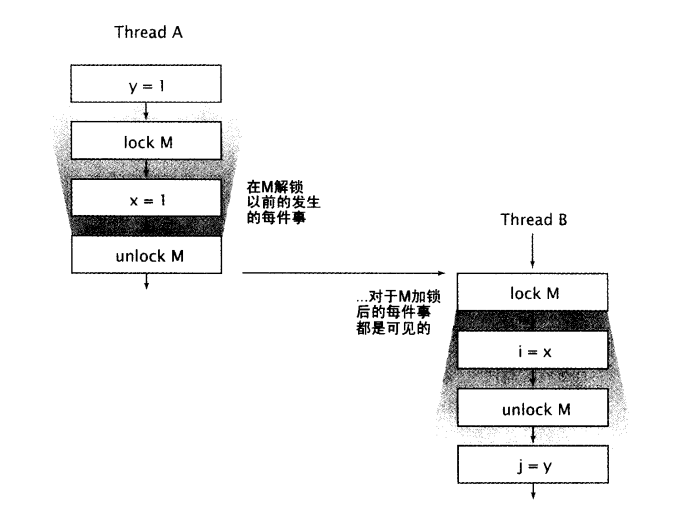

## 1. 什么是存储模型，要它何用

```java
value = 100
```

在多线程环境中，要获取到 value 的正确值，需要用到同步。

* 编译器生成指令的次序，可以不同于源代码的所暗示的"显然"版本，而且编译器还会把变量存储在寄存器，而不是内存中；
* 处理器可以乱序或者并发的执行指令；
* 缓存会改变写入提交到主内存的变量的次序；
* 存储在处理器本地缓存中的值，对于其它处理器并不可见。

这些因素都会妨碍一个线程看到一个变量的最新值，而且会引起内存活动在不同线程在表现出不同的发生次序。


指令重排序是的程序在计算性能上得到了很大的提升。在多线程环境中，为了维护正确的顺序性不得不产生很大的性能开销。因为在大部分时间里，同步的应用程序中的线程都在做属于自己的工作，额外的线程间协调只会降低程序的运行效率，不会带来任何好处。只有当多个线程要共享数据时，才必须协调它们的活动；协调是通过使用同步完成的，JVM依赖于程序明确地指出何时需要协调线程的活动。JMM规定了JVM必须遵循一组最小保证，这组保证规定了对变量的写入操作在何时将对其他线程可见。


### 1.1 平台的存储模型

每个处理器都拥有自己的缓存，并且定期地与主内存进行协调，在不同的处理器架构中提供了不同级别的缓存一致性，即允许不同的处理器在任意时刻从同一个存储位置上看到不同的值。JVM通过在适当的位置上插入**内存栅栏**来屏蔽在JMM与底层平台内存模型之间的差异。**Java程序不需要指定内存栅栏的位置，而只需通过正确地使用同步来找出何时将访问共享状态**。


### 1.2 重排序

各种能够引起操作延迟或者错续执行的不同原因，都可以归结为一类重拌序(reordering)。

> 没有充分同步的程序

```java
public class PossibleReordering {
    static int x = 0, y = 0;
    static int a = 0, b = 0;

    public static void main(String[] args) throws InterruptedException {
        Thread one = new Thread(new Runnable() {
            public void run() {
                a = 1;
                x = b;
            }
        });
        Thread other = new Thread(new Runnable() {
            public void run() {
                b = 1;
                y = a;
            }
        });
        one.start();
        other.start();
        one.join();
        other.join();
        System.out.println("(" + x + "," + y + ")");
    }
}
```

线程A可以在B开始前完成，B也可以在A开始前完成。可能会打印出 (1,0)、(0,1)、(1,1)。这只是一个极为简单的程序，不过可能的结果却有好几个。内存级的重排序会让程序的行为变得不可预期。没有同步，推断执行次序的难度令人望而却步。同步抑制了编译器、运行时和硬件对存储操作的各种方式的重排序，否则这些重排序将会破坏 JMM 提供的可见性保证。


### 1.3 java 存储模型的简介

* Java 存储模型的定义是通过**动作**(actions)的形式进行描述的，所调动作，包括变量的读和写、监视器加锁和释放锁、线程的启动和拼接(join)。
* JMM为程序中所有的操作定义了一个**偏序关系**，称为**Happens-Before**，使在正确同步的程序中不存在**数据竞争（缺乏Happens-Before关系，那么JVM可以对它们任意地重排序）**。
* Happens-Before 的法则包括：
    1. **程序顺序规则**。如果程序中操作A在操作B之前，那么在线程中A操作将在B操作之前执行
    2. **监视器锁规则。**在监视器锁上的解锁操作必须在同一个监视器锁上的加锁操作之前执行。（显式锁和内置锁在加锁和解锁等操作上有着相同的内存语义）
    3. **volatile变量规则。**对volatile变量的写入操作必须在对该变量的读操作之前执行。（原子变量与volatile变量在读操作和写操作上有着相同的语义）
    4. **线程启动规则。**在线程上对Thread.start的调用必须在该线程中执行任何操作之前执行
    5. **线程结束规则。**线程中的任何操作都必须在其他线程检测到该线程已经结束之前执行，或者从Thread.join中成功返回，或者在调用Thread.isAlive时返回false
    6. **中断规则。**当一个线程在另一个线程上调用interrupt时，必须在被中断线程检测到interrupt调用之前执行（通过抛出InterruptException，或者调用isInterrupted和interrupted）
    7. **终结器规则。**对象的构造函数必须在启动该对象的终结器之前执行完成
    8. **传递性。**如果操作A在操作B之前执行，并且操作B在操作C之前执行，那么操作A必须在操作C之前执行。


两个线程同步使用一个公共锁时：



线程A内部的所有动作都是依照“程序次序法则” 进行排序的。线程B的内部动作也一样。因为A释放了锁 M，B随后获得了锁M，A中的所有释放锁之前的动作，也就因此排到了B中请求到锁后动作的前面。


## 2. 发布

造成不正确发布的真正原因：”发布一个共享对象”与”另一个线程访问该对象”之间缺少一种 Happens-Before 的关系。


### 2.1 不安全的发布

在缺少 happens-before 关系的情况下，存在重排序的可能性。

在没有充分同步的情况下就发布一个对象，会导致另外的线程看到一个部分创建对象。新对象的初始化涉及到写入变量(新对象的域)。引用的发布涉及到写入另一个变量(新对象的引用)，那么写入新对鞋的引用与写入对象域可以被重排序。

> 不安全的惰性初始化

```java
import net.jcip.annotations.NotThreadSafe;

@NotThreadSafe
public class UnsafeLazyInitialization {
    private static Resource resource;

    public static Resource getInstance() {
        if (resource == null) {
            resource = new Resource(); // 不安全的发布
        }
        return resource;
    }

    static class Resource {
    }
}
```

假设第一次调用 getInstance 的是线程A。它会看到 resource 是 null，接着初始化一个新的 Resource，然后设置 resource 引用这个新实例。随后线程B调用 getInstance，它可能看到 resource 已经有了一个非空的值，于是就使用这个已经创建的 Resource。发布对象时存在数据竞争，因此B并不能保证可以看到 Resource 的正确状态。

**除了不可变对象以外，使用被另一个线程初始化的对象，是不安全的，除非对象的发布是 happens-before 于对象的消费线程使用它。**


### 2.2 安全发布

BlockingQueue的同步机制保证put在take后执行，A线程放入对象能保证B线程取出时是安全的。

借助于类库中现在的**同步容器、使用锁保护共享变量、或都使用共享的volatile类型变量**，都可以保证对该变量的读取和写入是按照happens-before排序的。

happens-before事实上可以比安全发布承诺更强的**可见性与排序性**。


### 2.3 安全初始化技巧

> 主动初始化

```java
import net.jcip.annotations.ThreadSafe;

@ThreadSafe
public class EagerInitialization {
    private static Resource resource = new Resource();

    public static Resource getResource() {
        return resource;
    }

    static class Resource {
    }
}
```


> 惰性初始化 holder 类技巧

```java
import net.jcip.annotations.ThreadSafe;

@ThreadSafe
public class ResourceFactory {
    private static class ResourceHolder {
        public static Resource resource = new Resource();
    }

    public static Resource getResource() {
        return ResourceHolder.resource;
    }

    static class Resource {
    }
}
```


### 2.4 双检查锁(double-checked locking)

> 双检查锁反模式

```java
import net.jcip.annotations.NotThreadSafe;

@NotThreadSafe
public class DoubleCheckedLocking {
    private static Resource resource;

    public static Resource getInstance() {
        if (resource == null) {
            synchronized (DoubleCheckedLocking.class) {
                if (resource == null)
                    resource = new Resource();
            }
        }
        return resource;
    }

    static class Resource {

    }
}
```


## 3. 初始化安全性

- 如果能确保初始化过程的安全性，被正确构造的不可变对象在没有同步的情况下也能安全地在多个线程之间共享
- 如果不能确保初始化的安全性，一些本应为不可变对象的值将会发生改变

初始化安全性只能保证通过final域可达的值从构造过程完成时可见性。对于通过非final域可达的值，或者在构成过程完成后可能改变的值，必须采用同步来确保可见性.

