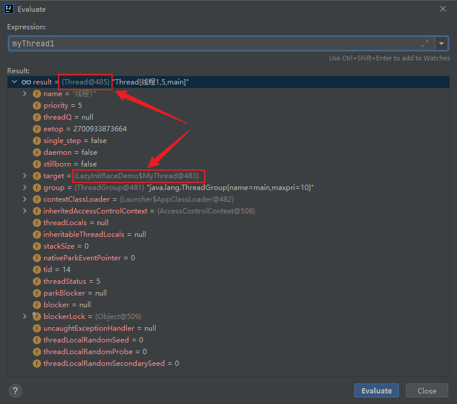
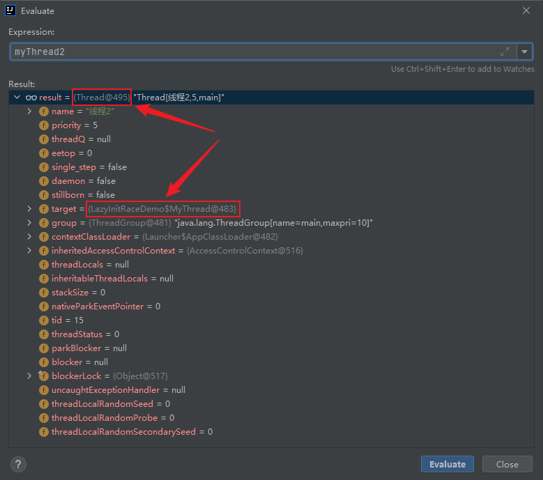

原子性：原子性是指操作是不可分的。如 `count++` 涉及 `读取`-`修改`-`写入` 的操作序列，因此它并不是一个不可分割的操作。

竞态条件(Race Condition) :计算的正确性取决于多个线程的交替执行时序时,就会发生竞态条件。


## 1. 常见竞态条件

1. 先检测后执行

   执行依赖于检测的结果,而检测结果依赖于多个线程的执行时序,而多个线程的执行时序通常情况下是不固定不可判断的,从而导致执行结果出现各种问题。

   ```
   例如：如果不存在 test.txt 文件，创建一个 test.txt 文件
   
   ---- 不存在 test.txt 文件 --------
   
   
   A 进程发现文件 test.txt 不存在
   同时，B 程也发现 文件 test.txt 不存在
   
   
   于是 A进程，先创建 test.txt 文件
   不过 B 进程不知道 A 进程以及 创建了 test.txt 文件
   
   
   最后 B 进程创建 test.txt 文件
   将 A 进程创建的 test.txt 文件给替换掉了
   ```

   

2. 延迟初始化

   延迟初始化，是将对象的初始化操作推迟到实际使用时才进行。同时确保只被初始化一次

## 2. 在没有同步的情况下统计已处理请求数量的 Servlet

```java
import net.jcip.annotations.NotThreadSafe;

import javax.servlet.Servlet;
import javax.servlet.ServletConfig;
import javax.servlet.ServletException;
import javax.servlet.ServletRequest;
import javax.servlet.ServletResponse;
import java.io.IOException;
import java.math.BigInteger;
import java.util.Arrays;

/**
 * @author osys
 */
@NotThreadSafe
public class UnsafeCountingFactories implements Servlet {

    private long count = 0;

    @Override
    public void init(ServletConfig servletConfig) throws ServletException {

    }

    @Override
    public ServletConfig getServletConfig() {
        return null;
    }

    @Override
    public void service(ServletRequest servletRequest, ServletResponse servletResponse) throws ServletException, IOException {
        BigInteger i = extractFromRequest(servletRequest);
        BigInteger[] factories = factor(i);
        ++count;
        encodeIntoResponse(servletResponse, factories);

        System.out.println("Input:" + servletRequest.getParameter("demo"));
        System.out.println("i=" + i.toString());
        System.out.println("factories=" + Arrays.toString(factories));
        System.out.println(count);
    }

    public long getCount() {
        return count;
    }

    void encodeIntoResponse(ServletResponse resp, BigInteger[] factors) { }

    public BigInteger extractFromRequest(ServletRequest req) {
        return new BigInteger("7");
    }

    public BigInteger[] factor(BigInteger i) {
        return new BigInteger[] { i };
    }

    @Override
    public String getServletInfo() {
        return null;
    }

    @Override
    public void destroy() {

    }
}
```


index.jsp

```jsp
<%--
  Created by IntelliJ IDEA.
  User: osys
  Date: 2022/3/25
  Time: 16:24
  To change this template use File | Settings | File Templates.
--%>
<%@ page contentType="text/html;charset=UTF-8" language="java" %>
<html>
    <head>
        <title>测试</title>
    </head>
    <body>
        <form name="f1" id="f2" action="${pageContext.request.contextPath}/Demo2" method="post">
            <table>
                <tr>
                    <td>创建数组:</td>
                    <td><label for="demo2"></label><input type="text" name="demo2" id="demo2"></td>
                </tr>
                <tr>
                    <td colspan="2"><input type="submit"></td>
                </tr>
            </table>
        </form>
    </body>
</html>
```


web.xml

```xml
<?xml version="1.0" encoding="UTF-8"?>
<web-app xmlns="http://xmlns.jcp.org/xml/ns/javaee"
         xmlns:xsi="http://www.w3.org/2001/XMLSchema-instance"
         xsi:schemaLocation="http://xmlns.jcp.org/xml/ns/javaee http://xmlns.jcp.org/xml/ns/javaee/web-app_4_0.xsd"
         version="4.0">
    
    <servlet>
        <!-- servlet注册的名字 -->
        <servlet-name>demoServlet2</servlet-name>
        <!-- servlet的全类名-->
        <servlet-class>UnsafeCountingFactories</servlet-class>
    </servlet>

    <servlet-mapping>
        <!-- 需要和某一个servlet节点的servlet子节点的文本节点一致 -->
        <servlet-name>demoServlet2</servlet-name>
        <!-- 映射具体 的访问路径: /  代表当前web应用的根目录 -->
        <url-pattern>/Demo2</url-pattern>
    </servlet-mapping>
</web-app>
```


运行 Tomcat，访问 `http://localhost:8080/`

多个页面同时进行 ---- 随意输入 `1234` 并提交，页面跳转到 `http://localhost:8080/Demo`

线程不安全。


## 3. 延迟初始化中的竞态条件

延迟初始化 ---- 先检查后执行


对于两个类

```java
@NotThreadSafe
public class LazyInitRace {

    private ExpensiveObject instance = null;

    public ExpensiveObject getInstance() {
        return instance;
    }

    public void setInstance(ExpensiveObject instance) {
        instance = instance;
    }
}
```

```java
public class ExpensiveObject {
    public ExpensiveObject() {
        System.out.println(Thread.currentThread().getName() + "----------------------- 创建了一个 ExpensiveObject 对象");
    }
}
```


实现 Runnable 接口

```java
public static class MyThread implements Runnable {

    private LazyInitRace lazyInitRace;

    public MyThread(LazyInitRace lazyInitRace) {
        this.lazyInitRace = lazyInitRace;
    }

    @Override
    public void run() {
        // 如果 ExpensiveObject == null，那么创建 ExpensiveObject 对象
        if (lazyInitRace.getInstance() == null) {
            lazyInitRace.setInstance(new ExpensiveObject());
        }
    }
}
```


创建多线程

```java
public class LazyInitRaceDemo {
    private static final MyThread thread = new MyThread(new LazyInitRace());

    public static void main(String[] args) {
        // 启动两个线程
        Thread myThread1 = new Thread(thread, "线程1");
        Thread myThread2 = new Thread(thread, "线程2");
        myThread1.start();
        myThread2.start();
    }
}
```


Debug:

执行 `start()` 前







对于两个不同的进程，指向的都是同一个 `LazyInitRaceDemo$MyThread` ，即对应的 `lazyInitRace` 为同一个，此时 `lazyInitRace` 里面的成员变量 `instance = null`。


Output

```
线程1----------------------- 创建一个 ExpensiveObject 对象
线程2----------------------- 创建一个 ExpensiveObject 对象
```


说明：

`start()`，线程1发现 `instance = null`，于是进行 `lazyInitRace.setInstance(new ExpensiveObject());`

同时，`start()`，线程2也发现 `instance = null`，于是也进行 `lazyInitRace.setInstance(new ExpensiveObject());`


## 4. 避免竞态条件问题

要避免这个问题，就必须在某个线程修改改变量时，通过某种方式防止其他线程使用这个变量，从而确保其他线程只能在修改操作完成之前或之后读取和修改状态，而不是在修改状态过程中。


使用 `AtomicLong` 类型的变量，来统计已处理请求的数量：

java

```java
import net.jcip.annotations.ThreadSafe;

import javax.servlet.Servlet;
import javax.servlet.ServletConfig;
import javax.servlet.ServletException;
import javax.servlet.ServletRequest;
import javax.servlet.ServletResponse;
import java.io.IOException;
import java.math.BigInteger;
import java.util.Arrays;
import java.util.concurrent.atomic.AtomicLong;

/**
 * @author osys
 */
@ThreadSafe
public class CountingFactories implements Servlet {

    private final AtomicLong count = new AtomicLong(0);

    public long getCount() {
        return count.get();
    }

    void encodeIntoResponse(ServletResponse resp, BigInteger[] factors) { }

    public BigInteger extractFromRequest(ServletRequest req) {
        return new BigInteger("7");
    }

    public BigInteger[] factor(BigInteger i) {
        return new BigInteger[] { i };
    }

    @Override
    public void init(ServletConfig servletConfig) throws ServletException {
    }

    @Override
    public ServletConfig getServletConfig() {
        return null;
    }

    @Override
    public void service(ServletRequest servletRequest, ServletResponse servletResponse) throws ServletException, IOException {
        BigInteger i = extractFromRequest(servletRequest);
        BigInteger[] factories = factor(i);
        count.incrementAndGet();
        encodeIntoResponse(servletResponse, factories);

        System.out.println("Input:" + servletRequest.getParameter("demo"));
        System.out.println("i=" + i.toString());
        System.out.println("factories=" + Arrays.toString(factories));
        System.out.println(count);
    }

    @Override
    public String getServletInfo() {
        return null;
    }

    @Override
    public void destroy() {

    }
}
```


index.jsp

```jsp
<%--
  Created by IntelliJ IDEA.
  User: osys
  Date: 2022/3/25
  Time: 16:24
  To change this template use File | Settings | File Templates.
--%>
<%@ page contentType="text/html;charset=UTF-8" language="java" %>
<html>
    <head>
        <title>测试</title>
    </head>
    <body>
        <form name="f3" id="f3" action="${pageContext.request.contextPath}/Demo3" method="post">
            <table>
                <tr>
                    <td>创建数组:</td>
                    <td><label for="demo3"></label><input type="text" name="demo3" id="demo3"></td>
                </tr>
                <tr>
                    <td colspan="2"><input type="submit"></td>
                </tr>
            </table>
        </form>
    </body>
</html>
```


web.xml

```xml
<?xml version="1.0" encoding="UTF-8"?>
<web-app xmlns="http://xmlns.jcp.org/xml/ns/javaee"
         xmlns:xsi="http://www.w3.org/2001/XMLSchema-instance"
         xsi:schemaLocation="http://xmlns.jcp.org/xml/ns/javaee http://xmlns.jcp.org/xml/ns/javaee/web-app_4_0.xsd"
         version="4.0">
    <servlet>
        <!-- servlet注册的名字 -->
        <servlet-name>demoServlet3</servlet-name>
        <!-- servlet的全类名-->
        <servlet-class>CountingFactories</servlet-class>
    </servlet>
    <servlet-mapping>
        <!-- 需要和某一个servlet节点的servlet子节点的文本节点一致 -->
        <servlet-name>demoServlet3</servlet-name>
        <!-- 映射具体 的访问路径: /  代表当前web应用的根目录 -->
        <url-pattern>/Demo3</url-pattern>
    </servlet-mapping>
</web-app>
```


运行 Tomcat，访问 `http://localhost:8080/`

多个页面同时进行 ---- 随意输入 `1234` 并提交，页面跳转到 `http://localhost:8080/Demo`

线程安全。

通过使用 `AtomicLong` 来代替 `long` 类型的计数器，能够确保所有对计数器状态的访问操作都是原子的。