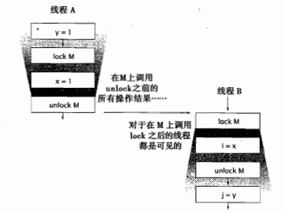

其实关键字 synchronized 关键字不仅仅能用于实现原子性或者确定 “临界区（Critical Section）”

同步还有另一个重要的方面：内存可见性（Memory Visibility）。

我们不仅希望防止某个线程正常使用对象状态而另一个线程再同时修改该状态，而且希望确保当一个线程修改了对象状态之后，其他线程能够看到发生状态变化。我们可以通过同步或者类库中内置的同步保证对象安全地发布。


## 1. 可见性

* 对于单线程而言，如果向某个变量先写入值，然后在没有其他写入操作的情况下，读取这个变量，其值是正确的。

* 多线程中。读操作、写操作，在不同的线程中执行，可能会导致读写不一致问题。

  ```
  data=1
  
  1. 线程A，读取data=1
  2. 线程A，修改data=2（还未写入）
  3. 线程B，读取data=1
  4. 线程A，写入data=2（此时data值为2）
  
  此时线程B读取的内容是data=1，而线程A已经将data修改为2了
  ```

  

## 2. 在没有同步的情况下共享变量

```java
/**
 * Created by osys on 2022/08/28 21:48.
 */
public class NoVisibility {
    /** 默认值为 false */
    private static boolean ready;
    /** 默认值为 0 */
    private static int number;

    private static class ReaderTread extends Thread {
        @Override
        public void run() {
            this.setName("Reader");
            while (!ready) {
                /*
                当一个线程使用了 Thread.yield() 方法之后，它就会把自己CPU执行的时间让掉，让自己或者其它的线程运行。
                
                打个比方：
                    现在有很多人在排队上厕所，好不容易轮到这个人上厕所了，突然这个人说：“我要和大家来个竞赛，看谁先抢到厕所！”。
                    然后所有的人在同一起跑线冲向厕所，有可能是别人抢到了，也有可能他自己有抢到了。
                    我们还知道线程有个优先级的问题，那么手里有优先权的这些人就一定能抢到厕所的位置吗?
                    不一定的，他们只是概率上大些，也有可能没特权的抢到了。
                 */
                Thread.yield();
            }
            System.out.println(number);
        }
    }

    // main 线程
    public static void main(String[] args) {
        // Reader 线程
        new ReaderTread().start();
        number = 66;
        ready = true;
    }
}
```

1. 这里一共有两个线程，Main 线程和 Reader 线程
2. 当多个线程在没有同步的情况下共享数据时，Main 线程和 Reader 线程都将访问共享变量 ready 和 number
3. Main 线程启动 Reader 线程，然后将 number 设为66，并将 ready 设为 true。
4. Reader 线程一直循环直到发现 ready 的值变为true，然后输出 number 的值。
5. 虽然 NoVisibility 看起来会输出66，但事实上很可能输出 0，或者根本无法终止。
6. 这是因为在代码中没有使用足够的同步机制，因此无法保证主线程写入的 ready 值和 number 值对于读线程来说是可见的。


## 3. 失效数据

```
data=1

1. 线程A，读取data=1
2. 线程A，修改data=2（还未写入）
3. 线程B，读取data=1
4. 线程A，写入data=2（此时data值为2）

此时线程B读取的内容是data=1，而线程A已经将data修改为2了
```

当线程A，和线程B获取的 data 数据均为 1 时。线程A对数据进行更改，此时线程B中获取的 data=1 数据为失效数据。


> 程序清单 3-2、3-3

```java
import net.jcip.annotations.NotThreadSafe;

/**
 * Created by osys on 2022/08/28 21:48.
 */
@NotThreadSafe
public class MutableInteger {
    private Integer value;

    public Integer getValue() {
        return value;
    }

    public void setValue(Integer value) {
        this.value = value;
    }
}
```

线程不安全：MutableInteger.java


```java
import net.jcip.annotations.GuardedBy;
import net.jcip.annotations.ThreadSafe;

/**
 * Created by osys on 2022/08/28 21:48.
 */
@ThreadSafe
public class SynchronizedInteger {
    @GuardedBy("this")
    private Integer value;

    public synchronized Integer getValue() {
        return value;
    }

    public synchronized void setValue(Integer value) {
        this.value = value;
    }
}
```

这里使用了两个同步代码块，来进行get、set操作。不过针对不同线程分别调用这两个方法，还是换出现数据安全性问题（失效值）。


## 4. 非原子的 64 位操作

计算机中存储数据和计算数据都是基于二进制来做的。在 Java 的基本数据类型中，long 和 double 是 64 位的。

| 类型    | 占用字节 | 占用位数 | 数值长度                                                     |
| ------- | -------- | -------- | ------------------------------------------------------------ |
| byte    | 1        | 8        | -128~127(-2的7次方到2的7次方-1)                              |
| short   | 2        | 16       | -32768~32767(-2的15次方到2的15次方-1)                        |
| int     | 4        | 32       | -2的31次方到2的31次方-1                                      |
| long    | 8        | 64       | -2的63次方到2的63次方-1                                      |
| float   | 4        | 32       | （e-45是乘以10的负45次方，e+38是乘以10的38次方) （2的-149次方~2的128次方-1） |
| double  | 8        | 64       | (2的-1074次方 ~ 2的1024次方)                                 |
| char    | 2        | 16       |                                                              |
| boolean |          | 1        |                                                              |

位数中，不同位代表的含义不一样，有符号位，指数位，尾数位。


非原子的 64 位操作

* 最低安全性：当线程在没有同步的情况下读取变量时，可能会得到一个失效值，但至少这个值是由之前某个线程设置的，而不再一个随机值。
* Java内存模型要求，变量的读取操作和写入操作都必须是原子操作。对于非 `volatile` 类型的 64 位数值变量(`long`、`double`)，JVM允许将64位的读操作或写操作分解为两个32为的操作。
* 当读取一个非 `volatile` 类型的 64 位数值变量(`long`、`double`) 时，如果对改变了的 `读` 操作和 `写` 操作在不同的线程中执行，那么很可能会读取到某个值的高32位和另一个值的低32位。
* 因此，即使不考虑失效数据问题，在多线程中使用共享且可变的`long`、`double` 等类型的变量也是不安全的，需要用 `volatile` 关键字来声明，或者用 `锁` 保护起来。


## 5. 加锁与可见性

内置锁可以用于确保某个线程以一种可预测的方式来查看另一个线程的执行结果。



当线程A执行某个同步代码块时，线程B随后进入由同一个锁保护的同步代码块。

在这种情况下可以保证，当线程B执行由锁保护的同步代码块时，可以看到前面线程A在同一个在代码块中的所有操作结果。

其实这就是为了确保某个线程写入该变量的值，对于其他线程来说都是可见的。

