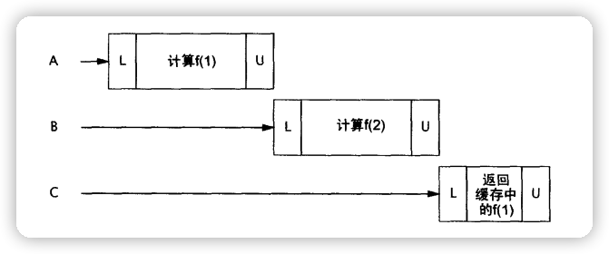
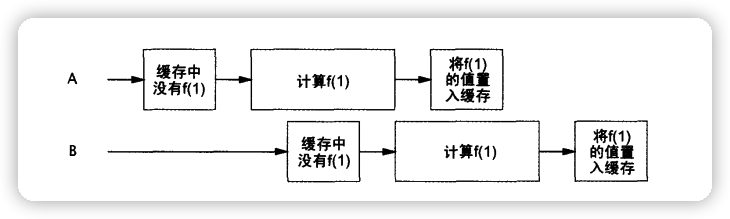
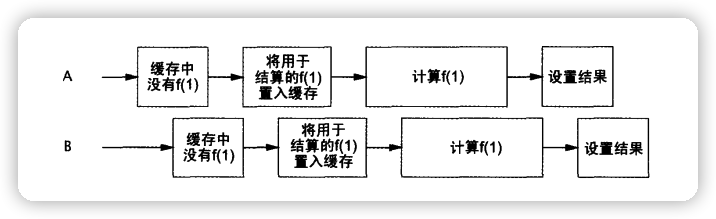

## 1. 为计算结果建立高效、可伸缩的高速缓存

几乎所有的服务器应用都会使用某种形式的缓存。

重用之前的计算结果能降低延迟，提高吞吐量，但却要消耗更多内存。

看上去简单的缓存，可能会将性能瓶颈转变成伸缩性瓶颈，即使缓存是用来提高单线程性能的。


## 2. `使用 HashMap 和同步` 来初始化缓存

```java
import net.jcip.annotations.GuardedBy;

import java.math.BigInteger;
import java.util.HashMap;
import java.util.Map;

/**
 * 尝试使用 HashMap 和同步来初始化缓存
 * @author osys
 */
public class Memoizer1<A, V> implements Computable<A, V> {
    @GuardedBy("this")
    private final Map<A, V> cache = new HashMap<>();
    private final Computable<A, V> computer;

    public Memoizer1(Computable<A, V> computer) {
        this.computer = computer;
    }

    @Override
    public synchronized V compute(A arg) throws InterruptedException {
        // 从缓存中获取，查看缓存中是否存在该值
        V result = cache.get(arg);
        if (result == null) {
            // 缓存中不存在该值，计算并返回
            result = computer.compute(arg);
            // 将就算返回的值，存入 map
            cache.put(arg, result);
        }
        return result;
    }
}


interface Computable <A, V> {
    V compute(A arg) throws InterruptedException;
}

class ExpensiveFunction implements Computable<String, BigInteger> {
    @Override
    public BigInteger compute(String arg) {
        return new BigInteger(arg);
    }
}
```

`Memorizer1` 将 `Computable` 实现类的计算结果缓存在`Map<A, V> cache`。

因为HashMap不是线程安全的，为了保证并发性，Memorizer1用了个很保守的方法，对整个compute方法进行同步。这导致了Memorizer1会有很明显的可伸缩性问题。

当有很多线程调用compute方法，就会出现类似下图的情况（并发性能弱）：




## 3. `用 ConcurrentHashMap` 来初始化缓存

```java
import java.util.Map;
import java.util.concurrent.ConcurrentHashMap;

/**
 * 用 ConcurrentHashMap 来初始化缓存
 * @author osys
 */
public class Memoizer2<A, V> implements Computable<A, V> {
    private final Map<A, V> cache = new ConcurrentHashMap<>();
    private final Computable<A, V> computer;

    public Memoizer2(Computable<A, V> computer) {
        this.computer = computer;
    }

    @Override
    public V compute(A arg) throws InterruptedException {
        // 将就算返回的值，存入 map
        V result = cache.get(arg);
        if (result == null) {
            // 缓存中不存在该值，计算并返回
            result = computer.compute(arg);
            // 将就算返回的值，存入 map
            cache.put(arg, result);
        }
        return result;
    }
}
```

* `ConcurrentHashMap`为了提高本身的并发能力，在内部采用了一个叫做`Segment`的结构，一个Segment其实就是一个类`HashTable`的结构，Segment内部维护了一个链表数组。该结构的带来的副作用是Hash的过程要比普通的HashMap要长，但是带来的好处是`写操作`的时候可以只对元素所在的Segment进行加锁即可，不会影响到其他的Segment。ConcurrentHashMap让锁的粒度更精细一些，并发性能更好。

* 当两个线程同时计算同一个值，它们并不知道有其它线程在做同一的事，存在着资源被浪费的可能。如下图：

    

    

## 4. `使用 ConcurrentHashMap＋FutureTask` 来初始化缓存

* `闭锁`是可以`延迟`线程的进度直到线程到达`终止状态`。Futurerask 可以作为闭锁。
* `闭锁`工作起来就像大门：直到闭锁达到终点状态之前，门一直是关闭的，没有线程能够通过，在终点状态到来的吋候，门开了，允许所有线程都通过。

```java
import java.util.Map;
import java.util.concurrent.Callable;
import java.util.concurrent.ConcurrentHashMap;
import java.util.concurrent.ExecutionException;
import java.util.concurrent.Future;
import java.util.concurrent.FutureTask;

/**
 * 用 FutureTask 记录包装器来初始化缓存
 * @author osys
 */
public class Memoizer3<A, V> implements Computable<A, V> {
    private final Map<A, Future<V>> cache = new ConcurrentHashMap<>();
    private final Computable<A, V> computer;

    public Memoizer3(Computable<A, V> computer) {
        this.computer = computer;
    }

    @Override
    public V compute(final A arg) throws InterruptedException {
        // 从缓存中获取，查看缓存中是否存在该值
        Future<V> cacheFuture = cache.get(arg);
        if (cacheFuture == null) {
            Callable<V> eval = new Callable<V>() {
                @Override
                public V call() throws InterruptedException {
                    // 缓存中不存在该值，计算并返回
                    return computer.compute(arg);
                }
            };
            // 将Future<V>，存入 map
            FutureTask<V> task = new FutureTask<>(eval);
            cacheFuture = task;
            cache.put(arg, task);
            // 执行 FutureTask，计算结果
            task.run();
        }
        try {
            // 获取结果并返回
            return cacheFuture.get();
        } catch (ExecutionException e) {
            throw LaunderThrowable.launderThrowable(e.getCause());
        }
    }
}
```

* Memorizer3 缓存的不是计算的结果，而是进行运算的 `Future<V> cacheFuture`。

* 因此首先检查有没有执行该任务的`FutureTask`

* 如果`有`执行该任务的`FutureTask`，则直接获得FutureTask

    ```java
    cacheFuture != null
    ```

    * 假如计算`已经完成`，FutureTask.get()方法可以立刻获得结果

        ```java
        return cacheFuture.get();
        ```

    * 假如计算`未完成`，后进入的线程阻塞直到`get()`返回结果；

* 如果`没有`执行该任务的`FutureTask`，则创建一个FutureTask进行运算，后续进了的同样的运算可以直接拿到结果或者等待运算完成获得结果。

    ```java
    if (cacheFuture == null) { ... }
    return cacheFuture.get();
    ```

    

* 此程序仍然存在一个问题，

    1. 当A线程判断没有对应的`cache.get(arg);`缓存为空（即`cache.get(arg)==null`）

    2. A线程创建`FutureTask`，还没进行`cache.put(arg, task);`操作

        ```java
        FutureTask<V> task = new FutureTask<>(eval);
        ```

    3. 这个时候，B线程判断缓存也是为空的（即`cache.get(arg)==null`），因为A线程还没进行`cache.put(arg, task);`操作

    4. B线程创建的FutureTask，就会会把A创建的FutureTask覆盖掉。

    5. 如下图：

        


## 5. `ConcurrentHashMap + FutureTask + Map原子操作` 来初始化缓存

```java
import java.util.concurrent.Callable;
import java.util.concurrent.CancellationException;
import java.util.concurrent.ConcurrentHashMap;
import java.util.concurrent.ConcurrentMap;
import java.util.concurrent.ExecutionException;
import java.util.concurrent.Future;
import java.util.concurrent.FutureTask;

/**
 * ConcurrentHashMap + FutureTask + Map原子操作 来初始化缓存
 * @author osys
 */
public class Memoizer<A, V> implements Computable<A, V> {
    private final ConcurrentMap<A, Future<V>> cache = new ConcurrentHashMap<>();
    private final Computable<A, V> computer;

    public Memoizer(Computable<A, V> computer) {
        this.computer = computer;
    }

    @Override
    public V compute(final A arg) throws InterruptedException {
        while (true) {
            // 从缓存中获取，查看缓存中是否存在该值
            Future<V> cacheFuture = cache.get(arg);
            if (cacheFuture == null) {
                Callable<V> eval = new Callable<V>() {
                    @Override
                    public V call() throws InterruptedException {
                        // 缓存中不存在该值，计算并返回
                        return computer.compute(arg);
                    }
                };
                // 将就算返回的值，存入 map（如果存在，就将返回值存入map）
                FutureTask<V> task = new FutureTask<>(eval);
                cacheFuture = cache.putIfAbsent(arg, task);
                // 查看是否存在该 FutureTask，如果存在，那么计算结果
                if (cacheFuture == null) {
                    cacheFuture = task;
                    task.run();
                }
            }
            try {
                // 获取结果并返回
                return cacheFuture.get();
            } catch (CancellationException e) {
                cache.remove(arg, cacheFuture);
            } catch (ExecutionException e) {
                throw LaunderThrowable.launderThrowable(e.getCause());
            }
        }
    }
}
```

程序做了两点改进：

1. 将 `FutureTask<V>` 存入 `Map` 时，使用 `ConcurrentHashMap.putIfAbsent()` 方法，使得原本复合的插入操作，原子化

2. 使用了 `while (true) { ... }` ，当在`cacheFuture.get()`阻塞线程（即Map中，存在`FutureTask<V>`，等待结果，所以`get()`方法阻塞），

    并抛出`CancellationException`异常，则会再一次申请一个创建FutureTask的机会。

