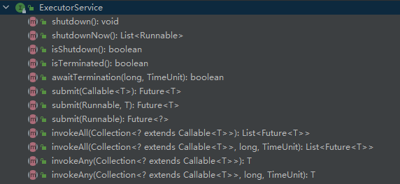

## 1. Executor 框架

**任务是逻辑上的工作单元，线程是使任务异步执行的机制。**

```java
package java.util.concurrent;

public interface Executor {

    /**
     * 在将来的某个时间执行给定的命令。该命令可以在新线程、池线程或调用线程中执行，具体取决于执行者实现。
     * @param command 可运行的任务
     */
    void execute(Runnable command);
}
```

Executor为任务提交和任务执行提供了解耦的标准方法。


## 2. 使用 Executor 实现 Web Server

```java
import java.io.IOException;
import java.net.ServerSocket;
import java.net.Socket;
import java.util.concurrent.Executor;
import java.util.concurrent.LinkedBlockingQueue;
import java.util.concurrent.ThreadPoolExecutor;
import java.util.concurrent.TimeUnit;

/**
 * Created by osys on 2022/08/28 21:48.
 */
public class TaskExecutionWebServer {
    private static final int THEAD_NUM = 100;
    private static final Executor EXEC = new ThreadPoolExecutor(THEAD_NUM, THEAD_NUM, 0, TimeUnit.MILLISECONDS, new LinkedBlockingQueue<Runnable>(100));

    public static void main(String[] args) throws IOException {
        ServerSocket socket = new ServerSocket(80);
        while (true) {
            final Socket connection = socket.accept();
            Runnable task = new Runnable() {
                @Override
                public void run() {
                    handleRequest(connection);
                }
            };
            EXEC.execute(task);
        }
    }

    private static void handleRequest(Socket connection) {
        // 处理逻辑
    }
}
```

通过Executor我们将任务`提交`和`执行`进行了解耦，代替了硬编码的创建线程。


## 3. 执行策略

一个执行策略明确了需要在任务执行过程关注的点：

- 任务在什么线程执行？
- 任务以什么方式执行？
- 可以有多少个任务并发执行？
- 可以有多少任务进入等待队列？
- 如果任务过载，需要放弃任务，怎么办？
- 一个任务执行前后，应该做什么？

执行策略是对资源管理的工具，最佳策略取决于可用的计算资源和你对服务质量的要求。


## 4. 线程池

* 线程池管理工作者线程，帮助我们管理工作线程的创建和销毁，工作队列的处理，可用让我们更加关注任务的编写上。
* 工作队列：其作用是持有所有等待执行的任务。


使用线程池好处：

* 重用存在的线程，而不是创建新的线程，这可以在处理多请求时抵消线程创建、消亡产生的开销。
* 在请求到达时，工作者线程通常已经存在，用于创建线程的等待时间并不会延迟任务的执行，因此提高了响应性。
* 通过适当地调整线程池的大小，你可以得到足够多的线程以保持处理器忙碌，同时可以还防止过多的线程相互竞争资源，导致应用程序耗尽内存或者失败。 


类库`Executors`提供了我们多种创建线程池的静态方法。

1. 定长线程池 `newCachedThreadPool()`

   ```java
   /**
    * 创建一个固定长度的线程池
    * 每次提交一个任务，就创建一个线程，直达达到线程池最大长度
    * 在需要创建线程时，使用提供的ThreadFactory创建新线程
    */
   public static ExecutorService newFixedThreadPool(int nThreads, ThreadFactory threadFactory) {
       return new ThreadPoolExecutor(nThreads, nThreads,
               0L, TimeUnit.MILLISECONDS,
               new LinkedBlockingQueue<Runnable>(),
               threadFactory);
   }
   ```

   使用的工作队列是`new LinkedBlockingQueue()`也就是**工作队列是无限的，最好设置固定大小**。

   

2. 可缓存线程池 `newCachedThreadPool()`

   ```java
   /**
    * 创建一个可缓存的线程池
    * 如果当前线程池的长度超过了处理的需要时，它可以灵活地回收空闲的线程
    * 当需求增加时，它可以灵活地添加新的线程，而并不会对池的长度作任何限制
    */
   public static ExecutorService newCachedThreadPool() {
       return new ThreadPoolExecutor(0, Integer.MAX_VALUE,
               60L, TimeUnit.SECONDS,
               new SynchronousQueue<Runnable>());
   }
   ```

   

3. 单线程化的 executor `newSingleThreadExecutor()`

   ```java
   /**
    * 创建一个单线程化的 executor
    * 它只创建唯一的工作者线程来执行任务，如果这个线程异常结束，会有另一个取代它
    * executor 会保证任务，依照任务队列所规定的顺序执行。 --- (FIFO, LIFO,优先级)
    */
   public static ExecutorService newSingleThreadExecutor() {
       return new Executors.FinalizableDelegatedExecutorService(
               new ThreadPoolExecutor(1, 1, 0L, 
                                      TimeUnit.MILLISECONDS, 
                                      new LinkedBlockingQueue<Runnable>()
               )
       );
   }
   ```

   

4. 定时的线程池 `newScheduledThreadPool()`

   ```java
   /**
    * 创建一个定长的线程池
    * 支持定时的，以及周期性的任务执行。
    */
   public static ScheduledExecutorService newScheduledThreadPool(int corePoolSize) {
       return new ScheduledThreadPoolExecutor(corePoolSize);
   }
   /**
    * 在需要创建线程时，使用提供的ThreadFactory创建新线程
    */
   public static ScheduledExecutorService newScheduledThreadPool(int corePoolSize, ThreadFactory threadFactory) {
       return new ScheduledThreadPoolExecutor(corePoolSize, threadFactory);
   }
   ```

   

## 5. Executor 的生命周期

Executor 本身并没有解决生命周期问题，它的子接口 `ExecutorService` 提供了一些接口用于解决这个问题：



* `shudown()` 方法

  ```java
  /**
   * 调用这个方法时，ExecutorService 停止接受任何新的任务
   * 且等待已经提交的任务执行完成，当所有已经提交的任务执行完毕后将会关闭ExecutorService
   * (已经提交的任务会分两类：一类是已经在执行的，另一类是还没有开始执行的)
   */
  void shutdown();
  ```

  

* `shutdownNow()` 方法

  ```java
  /**
   * 调这个方法会强制关闭 ExecutorService，
   * 它将取消所有运行中的任务和在工作队列中等待的任务，
   * 这个方法返回一个 List 列表，列表中返回的是等待在工作队列中的任务
   */
  List<Runnable> shutdownNow();
  ```

  

* `isShutdown()` 方法

  ```java
  /** ExecutorService 关闭后返回true，否则返回false */
  boolean isShutdown();
  ```

  

* `isTerminated()` 方法

  ```java
  /**
   * ExecutorService 关闭后所有任务都已完成，则返回true
   * 注意：除非先调用 shutdown() 或 shutdowNow()，否则 isTerminated 永远不会为 true
   */
  boolean isTerminated();
  ```

  

* `awaitTermination()` 方法

  ```java
  /**
   * 在执行 shutdown() 后，阻塞 ExecutorService 关闭，
   * 直到所有任务都完成，或者直到 timeout，或者当前线程被中断。
   * 以先发生者为准。
   * @param timeout 超时时间
   * @param unit 超时参数的时间单位。
   * @return 如果 ExecutorService 关闭，return true
   *         如果 timeout，ExecutorService 还未关闭，return false
   *         当前线程被中断，抛出 InterruptedException 异常
   */
  boolean awaitTermination(long timeout, TimeUnit unit) throws InterruptedException;
  ```

  

* `submit()` 方法

  ```java
  /**
   * 提交一个任务到 Executor 工作队列中，执行该任务，并返回 Future<T> 结果。
   * 参为 Runnable 时，执行 Runnable 的 run()方法
   *      返回值 Future.get() 的结果为 null。
   * 参为 Runnable 和 result 时，执行 Runnable 的 run()方法
   *      返回值 Future.get() 的结果为传入的 result。
   * 参为 Callable 时，则执行 Callable 的 call() 方法，
   *      返回值 Future.get() 的结果为 call() 的返回值。
   * @param task 两种类型的 task：Callable<T>、Runnable
   * @param result 返回的结果
   * @return 执行后，返回的是 Future<T> 对象
   */
  <T> Future<T> submit(Callable<T> task);
  
  <T> Future<T> submit(Runnable task, T result);
  
  Future<?> submit(Runnable task);
  ```

  

* `invokeAll()` 方法

  ```java
  /**
   * 提交任务集到 ExecutorService，返回所有任务的执行结果。
   * 该方法会阻塞，必须等待所有的任务执行完成后统一返回。
   * 
   * 如果全部任务在指定的时间内没有完成，则抛出异常。
   * @param tasks Collection<? extends Callable<T>>
   * @param timeout 超时时间
   * @param unit 时间单位
   * @return 执行后，返回的是 <T> List<Future<T>> 对象
   */
  <T> List<Future<T>> invokeAll(Collection<? extends Callable<T>> tasks) throws InterruptedException;
  
  <T> List<Future<T>> invokeAll(Collection<? extends Callable<T>> tasks, long timeout, TimeUnit unit)  throws InterruptedException;
  ```

  

* `invokeAny()` 方法

  ```java
  /** 提交任务集到 ExecutorService，返回第一个执行完的任务的结果值 */
  <T> T invokeAny(Collection<? extends Callable<T>> tasks) throws InterruptedException, ExecutionException;
  
  /** 提交任务集到 ExecutorService，在指定时间内，返回第一个执行完的任务的结果值，否则 Exception */
  <T> T invokeAny(Collection<? extends Callable<T>> tasks, long timeout, TimeUnit unit) throws InterruptedException, ExecutionException, TimeoutException;
  ```


> 支持关闭操作的 Web Server 示例

```java
import java.io.IOException;
import java.net.ServerSocket;
import java.net.Socket;
import java.util.concurrent.ExecutorService;
import java.util.concurrent.LinkedBlockingQueue;
import java.util.concurrent.RejectedExecutionException;
import java.util.concurrent.ThreadPoolExecutor;
import java.util.concurrent.TimeUnit;
import java.util.logging.Level;
import java.util.logging.Logger;

/**
 * Created by osys on 2022/08/28 21:48.
 */
public class LifecycleWebServer {

    private  int THREAD_NUM = 10;
    /** 创建 ExecutorService */
    private final ExecutorService exec = new ThreadPoolExecutor(THREAD_NUM, THREAD_NUM, 0, TimeUnit.MILLISECONDS, new LinkedBlockingQueue<>(100));

    public void start() throws IOException {
        // 创建 socket 连接
        ServerSocket socket = new ServerSocket(80);
        // ExecutorService 未关闭
        while (!exec.isShutdown()) {
            try {
                // 接受Socket连接
                final Socket conn = socket.accept();
                // 向 ExecutorService 提交任务
                exec.execute(new Runnable() {
                    @Override
                    public void run() {
                        handleRequest(conn);
                    }
                });
            } catch (RejectedExecutionException e) {
                if (!exec.isShutdown()) {
                    log("任务提交被拒绝", e);
                }
            }
        }
    }

    public void stop() {
        exec.shutdown();
    }

    private void log(String msg, Exception e) {
        Logger.getAnonymousLogger().log(Level.WARNING, msg, e);
    }

    /** 处理逻辑 */
    void handleRequest(Socket connection) {
        Request req = readRequest(connection);
        if (isShutdownRequest(req)) {
            stop();
        } else {
            dispatchRequest(req);
        }
    }

    interface Request {
    }

    private Request readRequest(Socket s) {
        return null;
    }

    private void dispatchRequest(Request r) {
    }

    private boolean isShutdownRequest(Request r) {
        return false;
    }
}
```

该实例，利用 `ExecutorService` 提供的生命周期管理方法进行处理


## 6. 延迟的、周期性的任务

在上面的 `线程池` 说明中，有描述到：**定时的线程池 `newScheduledThreadPool()`**

```java
/**
 * 创建一个定长的线程池
 * 支持定时的，以及周期性的任务执行。
 */
public static ScheduledExecutorService newScheduledThreadPool(int corePoolSize) {
    return new ScheduledThreadPoolExecutor(corePoolSize);
}
/**
 * 在需要创建线程时，使用提供的ThreadFactory创建新线程
 */
public static ScheduledExecutorService newScheduledThreadPool(int corePoolSize, ThreadFactory threadFactory) {
    return new ScheduledThreadPoolExecutor(corePoolSize, threadFactory);
}
```

`ScheduledExecutorService` 接口继承了 `ExecutorService` 接口。其接口方法有：

```java
/**
 * 创建并执行在给定延迟后启用的单次操作。
 * command - 要执行的任务
 * delay - 从现在开始延迟执行的时间
 * unit - 延时参数的时间单位
 * 
 * return 表示任务等待完成，并且其的 ScheduledFuture get()方法将返回 null
 *
 * Exception
 *      RejectedExecutionException - 如果任务无法安排执行
 *      NullPointerException - 如果命令为空
 */
public ScheduledFuture<?> schedule(Runnable command, long delay, TimeUnit unit);

/**
 * 创建并执行在给定延迟后启用的ScheduledFuture。
 *
 * callable - 执行的功能
 * delay - 从现在开始延迟执行的时间
 * unit - 延迟参数的时间单位
 *
 * return 一个可用于提取结果或取消的ScheduledFuture
 *
 * Exception
 *      RejectedExecutionException - 如果该任务无法安排执行
 *      NullPointerException - 如果可调用为空
 */
public <V> ScheduledFuture<V> schedule(Callable<V> callable, long delay, TimeUnit unit);

/**
 * 创建并执行在给定的初始延迟之后，随后以给定的时间段首先启用的周期性动作; 
 * 那就是执行将在 initialDelay 之后开始，然后 initialDelay + period ，然后是initialDelay + (2 * period) ......。 
 * 如果任务的执行遇到异常，则后续的执行被抑制。 否则，任务将仅通过取消或终止执行人终止。 
 * 如果任务执行时间比其周期长，则后续执行可能会迟到，但不会同时执行。
 *
 * command - 要执行的任务
 * initialDelay - 延迟第一次执行的时间
 * period - 连续执行之间的时期
 * unit - initialDelay和period参数的时间单位
 *
 * return 一个ScheduledFuture代表待完成的任务，其 get()方法将在取消时抛出异常
 *
 * Exception
 *      RejectedExecutionException - 如果该任务无法安排执行
 *      NullPointerException - 如果可调用为空
 *      IllegalArgumentException - 如果周期小于或等于零
 */
public ScheduledFuture<?> scheduleAtFixedRate(Runnable command, long initialDelay, long period, TimeUnit unit);

/**
 * 创建并执行在给定的初始延迟之后，首先启用的定期动作，随后在一个执行的终止和下一个执行的开始之间给定的延迟。 
 * 如果任务的执行遇到异常，则后续的执行被抑制。 否则，任务将仅通过取消或终止执行人终止。
 *
 * command - 要执行的任务
 * initialDelay - 延迟第一次执行的时间
 * period - 连续执行之间的时期
 * unit - initialDelay 和 period 参数的时间单位
 *
 * return 一个 ScheduledFuture 代表待完成的任务，其 get() 方法将在取消时抛出异常
 *
 * Exception
 *      RejectedExecutionException - 如果该任务无法安排执行
 *      NullPointerException - 如果可调用为空
 *      IllegalArgumentException - 如果周期小于或等于零
 */
public ScheduledFuture<?> scheduleWithFixedDelay(Runnable command, long initialDelay, long delay, TimeUnit unit);
```

**对于延迟、周期任务可以考虑使用 `ScheduledThreadPoolExecutor` **

