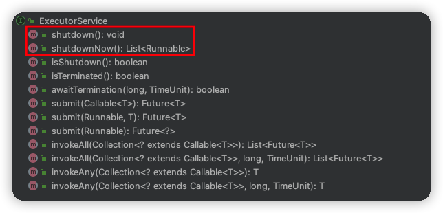

## 1. 停止基于线程的服务

* 应用程序通常会创建拥有线程的服务，比如线程池，这些服务的存在时间通常比创建它们的方法存在的时间更长。

* 线程通过一个 Thread 对象表示，像其它对象一样，线程可以被自由的共享。线程API中并没有关于线程所属权正规的概念。
* 如果应用程序优雅地退出，这些服务的线程也需要结束。因为没有退出线程惯用的优先方法，它们需要自行结束。
* 通常我们使用线程池来创建线程和关闭线程。线程池即为线程的拥有者，操作线程、改变优先级等都由线程池来负责。
* 服务应该提供生命周期方法来关闭自己，并关闭它所拥有的线程。当我们关闭应用程序这个服务时，服务就可以关闭所有的线程了。
* ExecutorService 提供了 shutdown()、shutdownNow() 方法，其它持有线程的服务，也应该提供类似的关闭机制。

> 对于持有线程的服务，主要服务的存在时间大于创建线程的方法的存在时间，那么就应该提供生命周期方法。


## 2. 示例：日志服务


> 不支持关闭的生产者-消费者日志服务

```java
import java.io.PrintWriter;
import java.io.Writer;
import java.util.concurrent.BlockingQueue;
import java.util.concurrent.LinkedBlockingQueue;

/**
 * Created by osys on 2022/08/28 21:48.
 */
public class LogWriter {
    private final BlockingQueue<String> queue;
    private final LoggerThread logger;
    private static final int CAPACITY = 1000;

    public LogWriter(Writer writer) {
        this.queue = new LinkedBlockingQueue<String>(CAPACITY);
        this.logger = new LoggerThread(writer);
    }

    public void start() {
        logger.start();
    }

    public void log(String msg) throws InterruptedException {
        queue.put(msg);
    }

    /**
     * 日记线程 class
     */
    private class LoggerThread extends Thread {
        private final PrintWriter writer;

        public LoggerThread(Writer writer) {
            this.writer = new PrintWriter(writer, true);
        }

        public void run() {
            try {
                while (true) {
                    writer.println(queue.take());
                }
            } catch (InterruptedException ignored) {
            } finally {
                writer.close();
            }
        }
    }
}
```

如上 LogWriter 为一个生产者-消费者模型，日志活动被分离到一个单独的日志线程中。产生消息的线程不会将消息直接写入输出流，而是由 LogWriter 通过 BlockingQueue 把这个任务提交给日志线程，并由日志线程写入。

在正常情况下，如何关闭日志线程？

* 取消一个生产者-消费者活动，既要取消生产者，又要取消消费者。
* 中断日志线程，应着手处理消费者，但是如果消费者和生产者不在同一个线程（如上LogWriter），生产者线程实现一个“检查在运行”
    * 生产者观察是否被关闭服务，
        * 如若关闭服务了，停止消息入队
        * 否则继续消息入队
    * 消费者正常消费消息，如若队列已空(被阻塞)，检查是否关闭了服务。
        * 如果关闭了服务，关闭消费者进程，然后关闭生产者进程
        * 如果未关闭服务，继续等待，直到有消息入队
    * 对于生产者而已，可能会存在，队列已满，消息被阻塞，无法入队。


> 向日志服务添加不可靠的关闭支持

```java
import java.io.PrintWriter;
import java.io.Writer;
import java.util.concurrent.BlockingQueue;
import java.util.concurrent.LinkedBlockingQueue;

/**
 * Created by osys on 2022/08/28 21:48.
 */
public class LogWriter2 {
    private final BlockingQueue<String> queue;
    private final LoggerThread2 logger;
    private static final int CAPACITY = 1000;

    private boolean isShutdownRequested = false;

    public LogWriter2(Writer writer) {
        this.queue = new LinkedBlockingQueue<String>(CAPACITY);
        this.logger = new LoggerThread2(writer);
    }

    public void start() {
        logger.start();
    }

    public void log(String msg) throws InterruptedException {
        queue.put(msg);
        if (!isShutdownRequested) {
            queue.put(msg);
        } else {
            throw new IllegalStateException("logger is shut down");
        }
    }
    
    public void setShutdownStatus(boolean status) {
        this.isShutdownRequested = status;
    }

    /**
     * 日记线程 class
     */
    private class LoggerThread2 extends Thread {
        private final PrintWriter writer;

        public LoggerThread2(Writer writer) {
            this.writer = new PrintWriter(writer, true);
        }

        public void run() {
            try {
                while (true) {
                    writer.println(queue.take());
                }
            } catch (InterruptedException ignored) {
            } finally {
                writer.close();
            }
        }
    }
}
```

这些不能解决最基本的问题，可能会导致失败，创建新日志消息的各个子任务都必须是原子操作。


> 向 LogWriter 中添加可靠的取消

```java
import net.jcip.annotations.GuardedBy;

import java.io.PrintWriter;
import java.io.Writer;
import java.util.concurrent.BlockingQueue;
import java.util.concurrent.LinkedBlockingQueue;

/**
 * Created by osys on 2022/08/28 21:48.
 */
public class LogService {
    private final BlockingQueue<String> queue;
    private final LoggerThread loggerThread;
    private final PrintWriter writer;
    @GuardedBy("this")
    private boolean isShutdown;
    @GuardedBy("this")
    private int reservations;

    public LogService(Writer writer) {
        this.queue = new LinkedBlockingQueue<String>();
        this.loggerThread = new LoggerThread();
        this.writer = new PrintWriter(writer);
    }

    public void start() {
        loggerThread.start();
    }

    public void stop() {
        synchronized (this) {
            isShutdown = true;
        }
        loggerThread.interrupt();
    }

    /** 生产 */
    public void log(String msg) throws InterruptedException {
        synchronized (this) {
            if (isShutdown) {
                throw new IllegalStateException("LogService Is Shut Down");
            }
            ++ reservations;
        }
        queue.put(msg);
    }

    /** 消费 */
    private class LoggerThread extends Thread {
        public void run() {
            try {
                while (true) {
                    try {
                        synchronized (LogService.this) {
                            if (!isShutdown || reservations != 0) {
                                // 队列中存在消息，LogService 未关闭
                            } else {
                                break;
                            }
                        }
                        // 消费
                        String msg = queue.take();
                        synchronized (LogService.this) {
                            --reservations;
                        }
                        writer.println(msg);
                    } catch (InterruptedException e) {
                    }
                }
            } finally {
                writer.close();
            }
        }
    }
}
```


## 3. 关闭 ExecutorService

在 ExecutorService 中提供了 shutdown()、shutdownNow() 方法对其进行关闭：



```java
/**
 * 调用这个方法时，ExecutorService 停止接受任何新的任务
 * 且等待已经提交的任务执行完成，当所有已经提交的任务执行完毕后将会关闭ExecutorService
 * (已经提交的任务会分两类：一类是已经在执行的，另一类是还没有开始执行的)
 */
void shutdown();

/**
 * 调这个方法会强制关闭 ExecutorService，
 * 它将取消所有运行中的任务和在工作队列中等待的任务，
 * 这个方法返回一个 List 列表，列表中返回的是等待在工作队列中的任务
 */
List<Runnable> shutdownNow();
```


> 使用 ExcutorService 的日志服务

```java
import java.io.PrintWriter;
import java.io.Writer;
import java.util.concurrent.BlockingQueue;
import java.util.concurrent.ExecutorService;
import java.util.concurrent.LinkedBlockingQueue;
import java.util.concurrent.RejectedExecutionException;
import java.util.concurrent.ThreadPoolExecutor;
import java.util.concurrent.TimeUnit;

public class LogService2 {
    private  int THREAD_NUM = 10;
    private final ExecutorService exec = new ThreadPoolExecutor(THREAD_NUM, THREAD_NUM, 0,
            TimeUnit.MILLISECONDS, new LinkedBlockingQueue<>(CAPACITY));
    private final long TIMEOUT = 10000;
    private final TimeUnit UNIT = TimeUnit.MILLISECONDS;
    private final WriteTask writer;
    private final BlockingQueue<String> queue;
    private static final int CAPACITY = 1000;

    public LogService2(Writer writer) {
        this.writer = new WriteTask(writer);
        this.queue = new LinkedBlockingQueue<String>(CAPACITY);
    }

    public void start() {}

    public void stop() throws InterruptedException {
        try{
            exec.shutdown();
            exec.awaitTermination(TIMEOUT, UNIT);
        } finally {
            writer.close();
        }
    }

    public void log(String msg) {
        try{
            queue.put(msg);
            exec.execute(writer);
        } catch (RejectedExecutionException ignored) {

        } catch (InterruptedException e) {
            throw new RuntimeException(e);
        }
    }

    private class WriteTask implements Runnable {

        private final PrintWriter writer;

        public WriteTask(Writer writer) {
            this.writer = (PrintWriter) writer;
        }

        public void close() {
            this.writer.close();
        }

        @Override
        public void run() {
            try {
                while (true) {
                    writer.println(LogService2.this.queue.take());
                }
            } catch (InterruptedException ignored) {
            } finally {
                writer.close();
            }
        }
    }
}
```


## 4. 致命药丸

致命药丸：一个置于队列中，可识别的对象。

我们可以使用 `致命药丸` 来关闭生产者-消费者服务。


> 使用致命药丸来关闭

```java
import java.io.File;
import java.io.FileFilter;
import java.util.concurrent.BlockingQueue;
import java.util.concurrent.LinkedBlockingQueue;

/**
 * Created by osys on 2022/08/28 21:48.
 */
public class IndexingService {
    private static final int CAPACITY = 1000;
    private static final File POISON = new File("");
    private final IndexerThread consumer = new IndexerThread();
    private final CrawlerThread producer = new CrawlerThread();
    private final BlockingQueue<File> queue;
    private final FileFilter fileFilter;
    private final File root;

    public IndexingService(File root, final FileFilter fileFilter) {
        this.root = root;
        this.queue = new LinkedBlockingQueue<File>(CAPACITY);
        // 创建一个文件过滤器对象，该 root 下的所有文件，会被生产者以这过滤器为条件，将所有文件使用【文件爬虫】添加到队列中
        this.fileFilter = new FileFilter() {
            /**
             * 测试指定的抽象路径名是否应包含在路径名列表中
             * @param pathname 路径名
             * @return true/false
             */
            public boolean accept(File pathname) {
                return pathname.isDirectory() || fileFilter.accept(pathname);
            }
        };
    }

    /** 文件是否已经加入到队列中，false表示未加入 */
    private boolean alreadyIndexed(File f) {
        return false;
    }

    public void start() {
        producer.start();
        consumer.start();
    }

    public void stop() {
        producer.interrupt();
    }

    public void awaitTermination() throws InterruptedException {
        consumer.join();
    }

    /**
     * 生产者：文件爬虫
     */
    class CrawlerThread extends Thread {
        public void run() {
            try {
                // 检索文件
                crawl(root);
            } catch (InterruptedException e) {
            } finally {
                while (true) {
                    try {
                        // 将药丸添加到队列中
                        queue.put(POISON);
                        break;
                    } catch (InterruptedException e1) {}
                }
            }
        }

        /**
         * 检索文件
         * @param root 文件/目录
         */
        private void crawl(File root) throws InterruptedException {
            // 【文件集合 + 文件夹集合】 的 path
            File[] entries = root.listFiles(fileFilter);
            // 检索文件 path，并添加到队列中
            if (entries != null) {
                for (File entry : entries) {
                    if (entry.isDirectory()) {
                        crawl(entry);
                    } else if (!alreadyIndexed(entry)) {
                        queue.put(entry);
                    }
                }
            }
        }
    }

    /**
     * 消费者：对检索出来的文件进行处理
     */
    class IndexerThread extends Thread {

        /** 对检索出来的文件进行处理，知道遇到【药丸】文件 */
        public void run() {
            try {
                while (true) {
                    File file = queue.take();
                    if (file == POISON)
                        break;
                    else
                        indexFile(file);
                }
            } catch (InterruptedException consumed) {
            }
        }

        /** 处理文件 */
        public void indexFile(File file) {
        };
    }
}
```


## 5. 示例：只执行一次的服务

如果一个方法需要处理一批任务，并在所有任务结束前不会返回，那么它可以通过使用私有的 Executor 来简化服务的生命周期管理，其中 Executor 的寿命限定在该方法中 (在这种情况下，通常会用到 `invokeAll` 和 `invokeAny` 方法）。

* `invokeAll()` 方法

    ```java
    /**
     * 提交任务集到 ExecutorService，返回所有任务的执行结果。
     * 该方法会阻塞，必须等待所有的任务执行完成后统一返回。
     * 
     * 如果全部任务在指定的时间内没有完成，则抛出异常。
     * @param tasks Collection<? extends Callable<T>>
     * @param timeout 超时时间
     * @param unit 时间单位
     * @return 执行后，返回的是 <T> List<Future<T>> 对象
     */
    <T> List<Future<T>> invokeAll(Collection<? extends Callable<T>> tasks) throws InterruptedException;
    
    <T> List<Future<T>> invokeAll(Collection<? extends Callable<T>> tasks, long timeout, TimeUnit unit)  throws InterruptedException;
    ```

    

* `invokeAny()` 方法

    ```java
    /** 提交任务集到 ExecutorService，返回第一个执行完的任务的结果值 */
    <T> T invokeAny(Collection<? extends Callable<T>> tasks) throws InterruptedException, ExecutionException;
    
    /** 提交任务集到 ExecutorService，在指定时间内，返回第一个执行完的任务的结果值，否则 Exception */
    <T> T invokeAny(Collection<? extends Callable<T>> tasks, long timeout, TimeUnit unit) throws InterruptedException, ExecutionException, TimeoutException;
    ```


> 在多台主机上并行的检查新邮件

使用私有 Executor，将它的寿命限定于一次方法调用中

```java
import java.util.Set;
import java.util.concurrent.ExecutorService;
import java.util.concurrent.Executors;
import java.util.concurrent.TimeUnit;
import java.util.concurrent.atomic.AtomicBoolean;

/**
 * Created by osys on 2022/08/28 21:48.
 */
public class CheckForMail {
    public boolean checkMail(Set<String> hosts, long timeout, TimeUnit unit) throws InterruptedException {
        ExecutorService exec = Executors.newCachedThreadPool();
        final AtomicBoolean hasNewMail = new AtomicBoolean(false);
        try {
            for (final String host : hosts) {
                exec.execute(new Runnable() {
                    public void run() {
                        if (checkMail(host)) {
                            hasNewMail.set(true);
                        }
                    }
                });
            }
        } finally {
            exec.shutdown();
            exec.awaitTermination(timeout, unit);
        }
        return hasNewMail.get();
    }

    /** 检查邮件 */
    private boolean checkMail(String host) {
        return false;
    }
}
```


## 6. shutdownNow() 的局限性

```java
/**
 * 调这个方法会强制关闭 ExecutorService，
 * 它将取消所有运行中的任务和在工作队列中等待的任务，
 * 这个方法返回一个 List 列表，列表中返回的是等待在工作队列中的任务
 */
List<Runnable> shutdownNow();
```


* 当通过 `shutdownNow` 来强行关闭 `ExecutorService` 时，它会尝试取消`正在运行的任务`并返回所有`已提交但尚未开始的任务`。
* 我们无法通过常规方法来找出哪些任务`已经开始但尚未结束`。这意味着我们无法在关闭过程中知道正在执行的任务的状态，除非任务本身会执行某种检查。


> 关闭之后，ExecutorService 获取被取消的任务

`TrackingExecutor` 中给出了如何在关闭过程中判断正在执行的任务。

```java
import java.util.ArrayList;
import java.util.Collections;
import java.util.HashSet;
import java.util.List;
import java.util.Set;
import java.util.concurrent.AbstractExecutorService;
import java.util.concurrent.ExecutorService;
import java.util.concurrent.TimeUnit;

/**
 * Created by osys on 2022/08/28 21:48.
 */
public class TrackingExecutor extends AbstractExecutorService {
    private final ExecutorService exec;

    /** 正在执行，且为完成的 runnable */
    private final Set<Runnable> tasksCancelledAtShutdown = Collections.synchronizedSet(new HashSet<Runnable>());

    public TrackingExecutor(ExecutorService exec) {
        this.exec = exec;
    }

    public void shutdown() {
        exec.shutdown();
    }

    public List<Runnable> shutdownNow() {
        return exec.shutdownNow();
    }

    public boolean isShutdown() {
        return exec.isShutdown();
    }

    public boolean isTerminated() {
        return exec.isTerminated();
    }

    public boolean awaitTermination(long timeout, TimeUnit unit) throws InterruptedException {
        return exec.awaitTermination(timeout, unit);
    }

    public List<Runnable> getCancelledTasks() {
        if (!exec.isTerminated()) {
            throw new IllegalStateException("线程池未关闭");
        }
        return new ArrayList<Runnable>(tasksCancelledAtShutdown);
    }

    public void execute(final Runnable runnable) {
        exec.execute(new Runnable() {
            public void run() {
                try {
                    runnable.run();
                } finally {
                    // 线程池关闭，且当前线程被标志为中断状态，那么将当前线程添加到 set 集合中
                    if (isShutdown() && Thread.currentThread().isInterrupted()) {
                        tasksCancelledAtShutdown.add(runnable);
                    }
                }
            }
        });
    }
}
```


> 使用 TrackingExecutorService 为后续执行来保存未完成的任务

```java
import net.jcip.annotations.GuardedBy;

import java.net.URL;
import java.util.ArrayList;
import java.util.Collections;
import java.util.HashSet;
import java.util.List;
import java.util.Set;
import java.util.concurrent.AbstractExecutorService;
import java.util.concurrent.ConcurrentHashMap;
import java.util.concurrent.ConcurrentMap;
import java.util.concurrent.ExecutorService;
import java.util.concurrent.Executors;
import java.util.concurrent.TimeUnit;

import static java.util.concurrent.TimeUnit.MILLISECONDS;

/**
 * 网络爬虫
 */
public abstract class WebCrawler {
    /** 线程池：关闭该线程池，能获得正在执行的线程任务 */
    private volatile TrackingExecutor exec;
    /** 要爬取的 url */
    @GuardedBy("this")
    private final Set<URL> urlsToCrawl = new HashSet<URL>();
    /** 已经爬取的 */
    private final ConcurrentMap<URL, Boolean> seen = new ConcurrentHashMap<>();
    private static final long TIMEOUT = 500;
    private static final TimeUnit UNIT = MILLISECONDS;

    public WebCrawler(URL startUrl) {
        urlsToCrawl.add(startUrl);
    }

    public synchronized void start() {
        exec = new TrackingExecutor(Executors.newCachedThreadPool());
        for (URL url : urlsToCrawl) {
            submitCrawlTask(url);
        }
        urlsToCrawl.clear();
    }

    /** 关闭线程池，将正在执行的爬虫程序对应的 url 保存起来到【urlsToCrawl】对象中 */
    public synchronized void stop() throws InterruptedException {
        try {
            saveUnCrawled(exec.shutdownNow());
            if (exec.awaitTermination(TIMEOUT, UNIT)) {
                saveUnCrawled(exec.getCancelledTasks());
            }
        } finally {
            exec = null;
        }
    }

    private void saveUnCrawled(List<Runnable> unCrawled) {
        for (Runnable task : unCrawled) {
            urlsToCrawl.add(((CrawlTask) task).getPage());
        }
    }

    /** 启动爬虫task，爬取url */
    private void submitCrawlTask(URL u) {
        exec.execute(new CrawlTask(u));
    }

    /** 爬虫 */
    private class CrawlTask implements Runnable {
        private final URL url;

        CrawlTask(URL url) {
            this.url = url;
        }

        private int count = 1;

        /** 已经爬取的 url */
        boolean alreadyCrawled() {
            return seen.putIfAbsent(url, true) != null;
        }


        void markUnCrawled() {
            seen.remove(url);
            System.out.printf("marking %s unCrawled%n", url);
        }

        /** 爬取 */
        public void run() {
            for (URL link : processPage(url)) {
                if (Thread.currentThread().isInterrupted()) {
                    return;
                }
                submitCrawlTask(link);
            }
        }

        public URL getPage() {
            return url;
        }
    }

    protected abstract List<URL> processPage(URL url);

    private class TrackingExecutor extends AbstractExecutorService {
        private final ExecutorService exec;

        /** 正在执行，且为完成的 runnable */
        private final Set<Runnable> tasksCancelledAtShutdown = Collections.synchronizedSet(new HashSet<Runnable>());

        public TrackingExecutor(ExecutorService exec) {
            this.exec = exec;
        }

        public void shutdown() {
            exec.shutdown();
        }

        public List<Runnable> shutdownNow() {
            return exec.shutdownNow();
        }

        public boolean isShutdown() {
            return exec.isShutdown();
        }

        public boolean isTerminated() {
            return exec.isTerminated();
        }

        public boolean awaitTermination(long timeout, TimeUnit unit) throws InterruptedException {
            return exec.awaitTermination(timeout, unit);
        }

        public List<Runnable> getCancelledTasks() {
            if (!exec.isTerminated()) {
                throw new IllegalStateException("线程池未关闭");
            }
            return new ArrayList<Runnable>(tasksCancelledAtShutdown);
        }

        public void execute(final Runnable runnable) {
            exec.execute(new Runnable() {
                public void run() {
                    try {
                        runnable.run();
                    } finally {
                        // 线程池关闭，且当前线程被标志为中断状态，那么将当前线程添加到 set 集合中
                        if (isShutdown() && Thread.currentThread().isInterrupted()) {
                            tasksCancelledAtShutdown.add(runnable);
                        }
                    }
                }
            });
        }
    }

}
```

